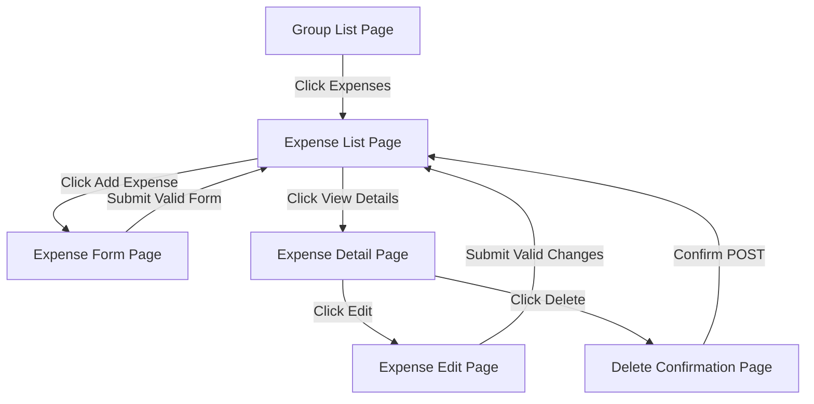
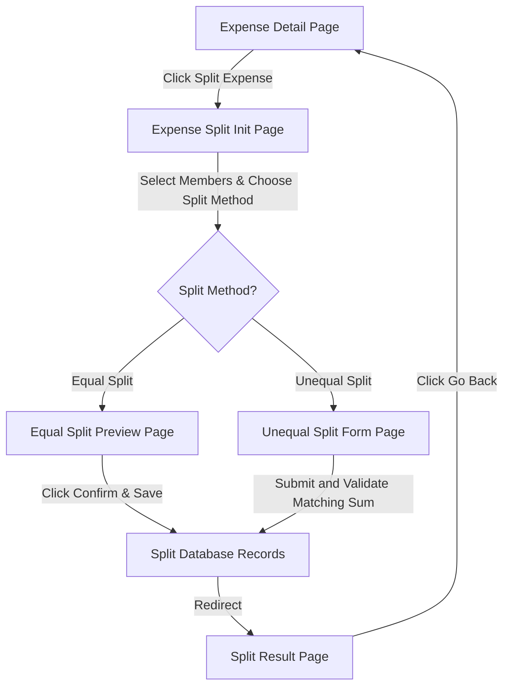
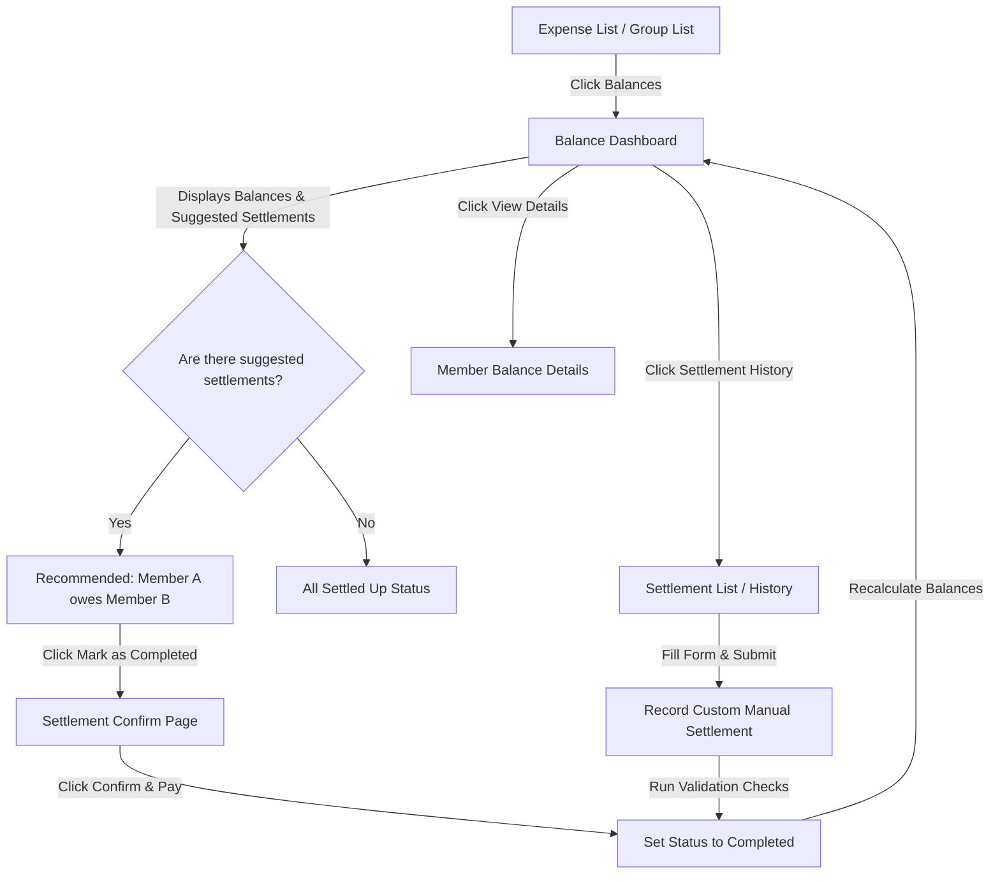

# Smart Expense Splitter - Complete Project Explanation & Guide

---

# PHASE 1: Project Setup and Architecture (फेज 1: प्रोजेक्ट सेटअप और आर्किटेक्चर)

## 1. Core Concepts (मूल सिद्धांत)

### What is a Virtual Environment? (वर्चुअल एनवायरनमेंट क्या है?)
* **English**: A virtual environment (`venv`) is an isolated environment that allows you to install Python packages for a specific project without affecting other projects or the global system settings.
* **Hindi**: वर्चुअल एनवायरनमेंट (`venv`) एक अलग (isolated) वातावरण है जो आपको सिस्टम के अन्य प्रोजेक्ट्स को प्रभावित किए बिना किसी विशिष्ट प्रोजेक्ट के लिए पायथन लाइब्रेरीज़ को इंस्टॉल करने की अनुमति देता है।

### What is Django and Django REST Framework? (जैंगो और जैंगो रेस्ट फ्रेमवर्क क्या है?)
* **English**: Django is a high-level Python web framework that encourages rapid development. Django REST Framework (DRF) is a powerful toolkit built on top of Django to build Web APIs.
* **Hindi**: Django एक उच्च-स्तरीय पायथन वेब फ्रेमवर्क है जो तेज़ी से वेब विकास करने में मदद करता है। Django REST Framework (DRF) एक टूलकिट है जिसका उपयोग Django के ऊपर Web APIs (वेब एपीआई) बनाने के लिए किया जाता है।

---

## 2. Steps Performed & Commands (किए गए स्टेप्स और कमांड्स)

1. **Renamed the folders**:
   * Renamed the project settings folder from `backend` to `config` to avoid confusion with the root directory.
   * Renamed the default app from `expense` to `expenses` (plural name for REST convention).
   * **Hindi**: सेटिंग्स फोल्डर का नाम `backend` से बदलकर `config` किया और ऐप का नाम `expense` से बदलकर `expenses` किया।

2. **Created `requirements.txt`**:
   * Defined Django, DRF, and CORS headers.
   * **Hindi**: `requirements.txt` फाइल बनाई और आवश्यक लाइब्रेरीज़ को लिखा।

3. **Installed Dependencies (डिपेंडेंसीज इंस्टॉल की)**:
   ```powershell
   .\venv\Scripts\python.exe -m pip install -r requirements.txt
   ```

4. **Updated Settings Imports (इंपोर्ट्स अपडेट किए)**:
   * Updated `manage.py`, `config/wsgi.py`, and `config/asgi.py` to point to `config.settings` instead of `backend.settings`.
   * **Hindi**: `manage.py`, `wsgi.py`, और `asgi.py` में `backend.settings` की जगह `config.settings` पाथ अपडेट किया।

---

## 3. Directory & File Explanations (डायरेक्टरी और फ़ाइल विवरण)

* **`manage.py`**:
  * **English**: The command-line utility that lets you interact with Django (run server, create migrations, run tests).
  * **Hindi**: यह एक कमांड-लाइन टूल है जिससे हम Django प्रोजेक्ट को चलाते हैं (जैसे सर्वर रन करना, डेटाबेस माइग्रेट करना)।
* **`config/settings.py`**:
  * **English**: Contains all configurations of the Django project including installed apps, middleware, database configuration, and CORS settings.
  * **Hindi**: इसमें पूरे प्रोजेक्ट की सेटिंग्स होती हैं जैसे कौन-से ऐप्स इंस्टॉल हैं, डेटाबेस कौन-सा है, और अन्य सेटिंग्स।
* **`config/urls.py`**:
  * **English**: The main routing file that maps URLs to views. It forwards API paths to `expenses/urls.py`.
  * **Hindi**: यह मुख्य राउटिंग फाइल है जो यूआरएल (URL) को सही व्यूज़ (Views) से जोड़ती है।

---

## 4. Best Practices & Common Mistakes (बेस्ट प्रैक्टिसेज और आम गलतियां)

* **Best Practice**: Always use a virtual environment so package versions do not conflict.
* **Best Practice (Hindi)**: हमेशा वर्चुअल एनवायरनमेंट का उपयोग करें ताकि पैकेज वर्शन्स में कोई टकराव न हो।
* **Common Mistake**: Forgetting to update `manage.py` or `wsgi.py` after renaming the settings directory, which throws a `ModuleNotFoundError`.
* **Common Mistake (Hindi)**: सेटिंग्स फोल्डर का नाम बदलने के बाद `manage.py` या `wsgi.py` में पुराना नाम छोड़ देना, जिससे एरर आता है।

---

## 5. Viva / Interview Questions (वाइवा / इंटरव्यू के प्रश्न)

1. **Question**: Why do we use `requirements.txt` in Python projects?
   * **Answer**: It lists all the packages and their versions needed to run the project so anyone can install them with a single pip command.
   * **Hindi Answer**: यह उन सभी पैकेजों की सूची है जो प्रोजेक्ट चलाने के लिए चाहिए, ताकि कोई भी इसे आसानी से एक कमांड से इंस्टॉल कर सके।
2. **Question**: What is CORS and why did we install `django-cors-headers`?
   * **Answer**: CORS stands for Cross-Origin Resource Sharing. We need it so our React frontend (running on a different port/origin) can communicate with our Django API.
   * **Hindi Answer**: CORS का मतलब क्रॉस-ओरिजिन रिसोर्स शेयरिंग है। इसकी जरूरत इसलिए है ताकि हमारा रिएक्ट फ्रंटएंड हमारे जैंगो एपीआई से बिना किसी सुरक्षा रुकावट के बात कर सके।

---
---

# PHASE 2: Database Model Design & Implementation (फेज 2: डेटाबेस मॉडल डिज़ाइन और इम्प्लीमेंटेशन)

## 1. Core Concepts (मूल सिद्धांत)

### What is Django ORM? (जैंगो ओआरएम क्या है?)
* **English**: ORM stands for Object-Relational Mapping. It allows us to interact with our SQLite database using Python classes and objects instead of writing raw SQL queries.
* **Hindi**: ORM का मतलब ऑब्जेक्ट-रिलेशनल मैपिंग है। यह हमें SQL क्वेरीज़ लिखे बिना पायथन क्लासेस और ऑब्जेक्ट्स का उपयोग करके डेटाबेस से बातचीत करने की अनुमति देता है।

### What are Migrations? (माइग्रेशन क्या हैं?)
* **English**: Migrations are Django’s way of propagating changes you make to your models (adding a field, deleting a model, etc.) into your database schema.
* **Hindi**: माइग्रेशन वह तरीका है जिससे Django आपके मॉडल्स (जैसे नया फील्ड जोड़ना या टेबल बनाना) में किए गए बदलावों को डेटाबेस में लागू करता है।

---

## 2. Steps Performed & Commands (किए गए स्टेप्स और कमांड्स)

1. **Write Models (मॉडल्स लिखे)**: Created database structure in `expenses/models.py`.
2. **Create Migration Files (माइग्रेशन फाइल्स बनाई)**:
   ```powershell
   .\venv\Scripts\python.exe manage.py makemigrations
   ```
3. **Apply Migrations (डेटाबेस में लागू किया)**:
   ```powershell
   .\venv\Scripts\python.exe manage.py migrate
   ```
4. **Run Unit Tests (यूनिट टेस्ट चलाए)**:
   ```powershell
   .\venv\Scripts\python.exe manage.py test
   ```

---

## 3. Code & Models Explanation (कोड और मॉडल्स विवरण)

### `Group` Model (ग्रुप मॉडल)
* **English**: Represents a group of users who share expenses. Uses `ManyToManyField(User)` to link multiple users to one group.
* **Hindi**: यह उन यूज़र्स के ग्रुप को दर्शाता है जो खर्चों को आपस में बांटते हैं।

### `Expense` Model (एक्सपेंस मॉडल)
* **English**: Represents a single bill paid by a user. Links to `Group` using `ForeignKey` (one group can have multiple expenses).
* **Hindi**: यह किसी यूज़र द्वारा किए गए भुगतान (जैसे बिजली बिल या डिनर बिल) को दर्शाता है।

### `ExpenseSplit` Model (एक्सपेंस स्प्लिट मॉडल)
* **English**: Specifies how much an individual user owes for a particular expense. Uses `unique_together = ('expense', 'user')` to prevent duplicate split entries.
* **Hindi**: यह दर्शाता है कि किसी विशिष्ट खर्चे के लिए किस यूज़र को कितने पैसे चुकाने हैं।

### `Settlement` Model (सेटलमेंट मॉडल)
* **English**: Records payments sent between users to settle balances (e.g. Bob paying Alice back).
* **Hindi**: यह यूज़र्स के बीच हुए पैसों के लेन-देन को रिकॉर्ड करता है जिससे उनके बीच का बकाया चुकता (settled) हो सके।

---

## 4. Best Practices & Common Mistakes (बेस्ट प्रैक्टिसेज और आम गलतियां)

* **Best Practice**: Use `DecimalField` instead of `FloatField` for currency and money calculations to avoid floating-point precision errors.
* **Best Practice (Hindi)**: पैसों या करेंसी के कैलकुलेशन के लिए हमेशा `DecimalField` का उपयोग करें, न कि `FloatField`, ताकि गणितीय शुद्धता बनी रहे।
* **Common Mistake**: Not specifying `on_delete=models.CASCADE` or `models.SET_NULL` for foreign keys, which causes model configuration errors.
* **Common Mistake (Hindi)**: फॉरेन की (Foreign Key) में `on_delete` बिहेवियर सेट न करना, जिससे माइग्रेशन एरर आ सकता है।

---

## 5. Viva / Interview Questions (वाइवा / इंटरव्यू के प्रश्न)

1. **Question**: What is the difference between `makemigrations` and `migrate`?
   * **Answer**: `makemigrations` generates Python code that describes database changes based on your models. `migrate` executes that code against the database to create or modify tables.
   * **Hindi Answer**: `makemigrations` मॉडल्स के बदलावों के आधार पर माइग्रेशन फाइल (Python कोड) बनाता है। `migrate` उस फाइल को रन करके डेटाबेस में टेबल बनाता या बदलता है।
2. **Question**: Why is `unique_together` useful in `ExpenseSplit`?
   * **Answer**: It ensures that a user cannot have two separate shares assigned to them for the same single expense, preserving database integrity.
   * **Hindi Answer**: यह यह सुनिश्चित करता है कि एक ही खर्चे के लिए किसी यूज़र के नाम पर दो बार अलग-अलग हिस्सेदारी (split) न दर्ज की जा सके।

---
---

# PHASE 2 (Continued): Detailed Database Design for Complete Features (फेज 2: पूर्ण फीचर्स के लिए विस्तृत डेटाबेस डिज़ाइन)

In this section, we design the full relational database schema required to support all project features. We explain the fields, relationships, dynamic calculations, and the new **Budget** model.

---

## 1. Core Features & Model Mappings (मुख्य फीचर्स और उनका मॉडल मैपिंग)

### A. User Login/Signup (यूज़र लॉगिन/साइनअप)
* **Model**: Built-in Django `User` model (`django.contrib.auth.models.User`).
* **Fields**: `id`, `username`, `email`, `password`, `first_name`, `last_name`.
* **Why it's needed**: Provides standard user authentication, session management, and password hashing out of the box.
* **Hindi Explanation**: यह Django का इन-बिल्ट (पहले से बना हुआ) मॉडल है जो यूज़र रजिस्ट्रेशन, लॉगिन, सुरक्षा और पासवर्ड हैशिंग की सुविधा देता है।

### B. Create Group & Add Members (ग्रुप बनाना और मेंबर्स जोड़ना)
* **Model**: `Group`
* **Fields**:
  * `id` (Primary Key)
  * `name` (CharField)
  * `description` (TextField)
  * `created_by` (ForeignKey -> User) — 1-to-Many relationship (one user can create many groups).
  * `members` (ManyToManyField -> User) — Many-to-Many relationship (a user can be in many groups, and a group can have many users).
  * `created_at` (DateTimeField)
* **Why it's needed**: Expense splitting is done within a group. This model groups users and links their memberships.
* **Hindi Explanation**: खर्चे बांटने के लिए ग्रुप बनाना जरूरी है। यह मॉडल यूज़र्स को एक ग्रुप में जोड़ने का काम करता है।

### C. Add Expense (खर्चा जोड़ना)
* **Model**: `Expense`
* **Fields**:
  * `id` (Primary Key)
  * `group` (ForeignKey -> Group) — Links the expense to a specific group.
  * `description` (CharField) — What the expense was for (e.g. "Tea & Snacks").
  * `amount` (DecimalField) — Total bill amount.
  * `paid_by` (ForeignKey -> User) — Who paid the bill.
  * `date` (DateField) — Date of transaction.
* **Why it's needed**: Stores the metadata of a transaction and records who made the primary payment.
* **Hindi Explanation**: यह किसी भी लेन-देन (transaction) की मुख्य जानकारी को स्टोर करता है, जैसे कि बिल किसने भरा और कुल कितना पैसा खर्च हुआ।

### D. Equal & Unequal Splits (बराबर और असमान रूप से पैसे बांटना)
* **Model**: `ExpenseSplit`
* **Fields**:
  * `id` (Primary Key)
  * `expense` (ForeignKey -> Expense) — Links to the main expense record.
  * `user` (ForeignKey -> User) — The member who owes money.
  * `amount` (DecimalField) — The specific share/portion they owe.
  * `is_settled` (BooleanField) — Tracks if this debt is cleared.
* **Why it's needed**:
  * **Equal Split (बराबर बांटना)**: If total is $90 and 3 members share, the backend dynamically calculates $30 for each and inserts 3 records into `ExpenseSplit`.
  * **Unequal Split (अलग-अलग बांटना)**: Allows custom shares (e.g., Alice owes $50, Bob owes $40). The backend validates that the sum of splits equals the total expense amount.
* **Hindi Explanation**: यह मॉडल प्रत्येक यूज़र के हिस्से का कर्ज रिकॉर्ड करता है। अगर बराबर बांटना है तो सिस्टम कुल राशि को मेंबर्स की संख्या से भाग (divide) करके समान रिकॉर्ड बनाता है। असमान रूप से बांटने पर कस्टम राशि की जांच करता है।

### E. Settlements (चुकता करना)
* **Model**: `Settlement`
* **Fields**:
  * `id` (Primary Key)
  * `group` (ForeignKey -> Group)
  * `payer` (ForeignKey -> User) — Who is sending the money to clear debt.
  * `payee` (ForeignKey -> User) — Who is receiving the payment.
  * `amount` (DecimalField) — Settlement amount.
  * `date` (DateTimeField)
  * `status` (CharField: pending/completed)
* **Why it's needed**: Tracks actual money transfers made to clear balances.
* **Hindi Explanation**: जब कोई यूज़र किसी दूसरे यूज़र को पैसे वापस चुकाता है, तो उस ट्रांजैक्शन को रिकॉर्ड करने के लिए इस मॉडल का उपयोग होता है।

### F. Budget Alert (बजट चेतावनी)
* **Model**: `Budget`
* **Fields**:
  * `id` (Primary Key)
  * `group` (ForeignKey -> Group, null=True, blank=True) — Optional, for group-specific budgets.
  * `user` (ForeignKey -> User, null=True, blank=True) — Optional, for personal user budgets.
  * `amount_limit` (DecimalField) — Maximum limit set (e.g., $500 monthly).
  * `created_at` (DateTimeField)
* **Why it's needed**: Allows users to set a budget threshold. If the total expenses in a group or for a user exceed this limit, the system alerts them.
* **Hindi Explanation**: यह मॉडल यूज़र को बजट लिमिट सेट करने की अनुमति देता है। यदि खर्च इस लिमिट से ज़्यादा होता है, तो सिस्टम चेतावनी (alert) दिखाता है।

---

## 2. Dynamic Calculations (डायनेमिक कैलकुलेशन)

### A. How View Balance works (बैलेंस देखना कैसे काम करता है)
We do **not** store balances directly in the database. Storing balances can lead to data inconsistency (e.g., if an expense is deleted but the balance field isn't updated). Instead, we calculate the balance dynamically using Django ORM aggregation:

$$ \text{Balance of User } U \text{ in Group } G = (\text{Total paid by } U) - (\text{Total owed by } U) + (\text{Total received in settlements}) - (\text{Total paid in settlements}) $$

* **Positive Balance**: User gets money back (लोग उसे पैसे देंगे).
* **Negative Balance**: User owes money to others (उसे दूसरों को पैसे देने हैं).

### B. Smart Settlement Logic (स्मार्ट सेटलमेंट लॉजिक)
Smart Settlement minimizes the number of transactions required to settle the group debt.
* **Example**:
  * Alice owes Bob $10.
  * Bob owes Charlie $10.
  * **Smart Settlement** bypasses Bob and suggests: Alice pays Charlie $10 directly (1 transaction instead of 2).
  * This is computed using a greedy algorithm at the API level (not in the database).

---

## 3. Best Practices & Common Mistakes (बेस्ट प्रैक्टिसेज और आम गलतियां)

* **Best Practice**: Never store redundant calculated values (like total user balance) in the database. Calculate them on the fly.
* **Best Practice (Hindi)**: कभी भी कुल बैलेंस जैसे कैलकुलेटेड वैल्यूज़ को डेटाबेस में परमानेंट स्टोर न करें। इन्हें हमेशा क्वेरी टाइम पर ही कैलकुलेट करें।
* **Common Mistake**: Allowing an expense total to not match the sum of its splits.
* **Common Mistake (Hindi)**: खर्चे की कुल राशि (Total Expense) और स्प्लिट राशियों के योग (Sum of Splits) में अंतर होने देना। कोडिंग के समय इसे वैलिडेट करना अनिवार्य है।

---

## 4. Viva / Interview Questions (वाइवा / इंटरव्यू के प्रश्न)

1. **Question**: Why do we use `DecimalField` instead of `FloatField` for storing amounts?
   * **Answer**: `FloatField` uses binary floating-point representation which causes precision loss during calculations. `DecimalField` stores exact decimal values, which is critical for financial transactions.
   * **Hindi Answer**: `FloatField` में फ्लोटिंग-पॉइंट की वजह से गणितीय गणनाओं में पैसे कम-ज्यादा (precision errors) हो सकते हैं। `DecimalField` पैसों का बिल्कुल सटीक मान स्टोर करता है।
2. **Question**: Explain Django's Many-to-Many relationship using the `Group` and `User` models.
   * **Answer**: A user can join multiple groups, and a group can contain multiple users. Django handles this by creating an intermediate join table automatically.
   * **Hindi Answer**: एक यूज़र कई ग्रुप्स का मेंबर हो सकता है और एक ग्रुप में कई यूज़र्स हो सकते हैं। Django इसके लिए बैकएंड में एक तीसरी 'जॉइन टेबल' (join table) बनाता है।
3. **Question**: Why is it better to calculate balances dynamically instead of storing them?
   * **Answer**: It ensures data integrity. If an expense is updated, added, or deleted, the balances are automatically correct without running complex database sync operations.
   * **Hindi Answer**: इससे डेटा की शुद्धता बनी रहती है। अगर कोई भी खर्चा हटाया या बदला जाता है, तो बैलेंस बिना किसी सिंक (sync) प्रक्रिया के तुरंत सही दिखाई देता है।

---
---

# PHASE 3: Django Models + ORM + Migrations (फेज 3: जैंगो मॉडल्स + ओआरएम + माइग्रेशन्स)

In this phase, we implemented the actual Django model classes inside `expenses/models.py`, generated structural migrations, migrated the SQLite database, and verified our schema using Python unit tests.

---

## 1. Django Models & Fields Explanation (जैंगो मॉडल्स और फील्ड्स का स्पष्टीकरण)

### A. Group Model (ग्रुप मॉडल)
Defines a team/group where members share expenses.
* **Fields**:
  * `name`: `CharField(max_length=100)`
    * **English**: Stores the name of the group. CharField requires a maximum length limit.
    * **Hindi**: ग्रुप का नाम स्टोर करने के लिए। इसके लिए अधिकतम लंबाई (max_length) तय करना जरूरी है।
  * `description`: `TextField(blank=True)`
    * **English**: Stores optional long description. `blank=True` means the description can be empty in forms.
    * **Hindi**: ग्रुप के बारे में विस्तार से लिखने के लिए। `blank=True` का मतलब है कि इसे खाली छोड़ा जा सकता है।
  * `created_by`: `ForeignKey(User, on_delete=models.SET_NULL, null=True)`
    * **English**: The user who created the group. `on_delete=models.SET_NULL` ensures that if the creator's account is deleted, the group itself is not deleted, but its creator field becomes null.
    * **Hindi**: ग्रुप बनाने वाला यूज़र। यदि बनाने वाले का अकाउंट डिलीट हो जाता है, तो ग्रुप डिलीट नहीं होगा, बस निर्माता का फील्ड खाली (null) हो जाएगा।
  * `members`: `ManyToManyField(User, related_name='expense_groups')`
    * **English**: Connects multiple users to a group. Django automatically creates an intermediate table to link users and groups.
    * **Hindi**: यह कई यूज़र्स को ग्रुप से जोड़ता है। Django बैकएंड में खुद एक तीसरी टेबल बनाकर इनके संबंधों को संभालता है।

### B. Expense Model (खर्चा मॉडल)
Defines a payment made for a group.
* **Fields**:
  * `group`: `ForeignKey(Group, on_delete=models.CASCADE, related_name='expenses')`
    * **English**: Group where the expense happened. `on_delete=models.CASCADE` means if the group is deleted, all its expenses are also deleted.
    * **Hindi**: वह ग्रुप जिसमें खर्चा हुआ। यदि ग्रुप डिलीट होता है, तो उसके सारे खर्चे भी डिलीट हो जाएंगे।
  * `description`: `CharField(max_length=255)`
    * **English**: A short text detailing what the bill was for.
    * **Hindi**: खर्चे का संक्षिप्त विवरण (जैसे: "डिनर का बिल")।
  * `amount`: `DecimalField(max_digits=10, decimal_places=2)`
    * **English**: Total money spent. Ensures absolute precision with 2 decimal points.
    * **Hindi**: कुल खर्च की गई राशि। दशमलव के बाद 2 अंकों तक की शुद्धता बनाए रखता है।
  * `paid_by`: `ForeignKey(User, on_delete=models.CASCADE, related_name='expenses_paid')`
    * **English**: The user who paid the total bill amount.
    * **Hindi**: वह यूज़र जिसने पूरा बिल भरा।
  * `date`: `DateField()`
    * **English**: Stores the day the expense occurred.
    * **Hindi**: खर्चा किस दिन हुआ, वह तारीख स्टोर करता है।

### C. ExpenseSplit Model (खर्चा हिस्सा मॉडल)
Defines how much each individual user owes for a specific expense.
* **Fields**:
  * `expense`: `ForeignKey(Expense, on_delete=models.CASCADE, related_name='splits')`
    * **English**: Parent transaction to which this split belongs.
    * **Hindi**: वह मुख्य खर्चा जिससे यह स्प्लिट (हिस्सा) जुड़ा हुआ है।
  * `user`: `ForeignKey(User, on_delete=models.CASCADE, related_name='splits_owed')`
    * **English**: The user who owes money for this split.
    * **Hindi**: वह यूज़र जिसके हिस्से में यह कर्ज आया है।
  * `amount`: `DecimalField(max_digits=10, decimal_places=2)`
    * **English**: Specific amount of money this user owes.
    * **Hindi**: वह राशि जो इस यूज़र को चुकानी है।
  * `is_settled`: `BooleanField(default=False)`
    * **English**: Boolean flag representing if the user has paid back their split share.
    * **Hindi**: यह दर्शाता है कि क्या यूज़र ने अपना यह हिस्सा चुका दिया है या नहीं।

### D. Settlement Model (सेटलमेंट मॉडल)
Tracks debt-clearance payments directly between users in a group.
* **Fields**:
  * `payer`: `ForeignKey(User, on_delete=models.CASCADE, related_name='settlements_sent')`
    * **English**: User who is sending the money to clear debt.
    * **Hindi**: वह यूज़र जो कर्ज चुकाने के लिए पैसे भेज रहा है।
  * `payee`: `ForeignKey(User, on_delete=models.CASCADE, related_name='settlements_received')`
    * **English**: User who is receiving the money.
    * **Hindi**: वह यूज़र जिसे पैसे मिल रहे हैं।
  * `amount`: `DecimalField(max_digits=10, decimal_places=2)`
    * **English**: Cash amount settled.
    * **Hindi**: चुकता की गई कुल राशि।

### E. Budget Model (बजट मॉडल)
Sets spending thresholds to trigger alert flags.
* **Fields**:
  * `group`: `ForeignKey(Group, on_delete=models.CASCADE, related_name='budgets', null=True, blank=True)`
    * **English**: Link to a specific group for group budget limits. Optional field.
    * **Hindi**: ग्रुप का बजट सेट करने के लिए। यह वैकल्पिक (optional) है।
  * `user`: `ForeignKey(User, on_delete=models.CASCADE, related_name='budgets', null=True, blank=True)`
    * **English**: Link to a user for individual monthly spending limit. Optional field.
    * **Hindi**: यूज़र का निजी बजट लिमिट सेट करने के लिए। यह भी वैकल्पिक है।
  * `amount_limit`: `DecimalField(max_digits=10, decimal_places=2)`
    * **English**: The maximum allowed monthly spending threshold.
    * **Hindi**: खर्च करने की अधिकतम सीमा।

---

## 2. Django Migration Commands (माइग्रेशन कमांड्स)

In Django, database tables are not modified directly. We write Python models, and Django handles database mapping via these two commands:

1. **`python manage.py makemigrations`**
   * **English**: Django inspects your modified models files and compiles Python scripts describing database schema changes (e.g., adding columns/tables). These files are saved in the `migrations/` folder.
   * **Hindi**: Django आपके मॉडल्स फ़ाइलों को देखता है और डेटाबेस स्कीमा में होने वाले बदलावों (जैसे नया टेबल या कॉलम) की एक स्क्रिप्ट फाइल बनाता है, जिसे `migrations/` फोल्डर में सेव किया जाता है।
2. **`python manage.py migrate`**
   * **English**: Reads the pending migration scripts and runs equivalent SQL statements against the SQLite database file to apply changes permanently.
   * **Hindi**: यह कमांड बनी हुई माइग्रेशन फाइलों को पढ़कर डेटाबेस पर SQL स्टेटमेंट्स चलाता है और डेटाबेस में बदलावों को स्थाई रूप से लागू करता है।

---

## 3. Best Practices & Common Mistakes (बेस्ट प्रैक्टिसेज और आम गलतियां)

* **Best Practice**: Always add index/related name lookups. Standardize using `related_name` in all Foreign Keys so you can easily reference reverse lookups (e.g., `group.expenses.all()` instead of `group.expense_set.all()`).
* **Best Practice (Hindi)**: सभी Foreign Keys में `related_name` का उपयोग करें ताकि विपरीत दिशा से आसानी से क्वेरी की जा सके (जैसे `group.expenses.all()`)।
* **Common Mistake**: Forgetting to generate migrations (`makemigrations`) after making edits in `models.py`. Running the server without applying migrations results in `OperationalError: no such table`.
* **Common Mistake (Hindi)**: मॉडल्स फ़ाइल बदलने के बाद माइग्रेशन रन करना भूल जाना। इससे सर्वर चलाते समय `no such table` एरर आता है।

---

## 4. Viva / Interview Questions (वाइवा / इंटरव्यू के प्रश्न)

1. **Question**: What is the purpose of `related_name` in a Django ForeignKey?
   * **Answer**: It defines the name of the reverse relation from the related model back to this model. If not defined, Django defaults to `<model_name>_set`.
   * **Hindi Answer**: यह विपरीत मॉडल से वर्तमान मॉडल को एक्सेस करने का नाम तय करता है। यदि आप इसे सेट नहीं करते हैं, तो Django डिफ़ॉल्ट रूप से `<model_name>_set` का उपयोग करता है।
2. **Question**: What happens to dependent rows when `on_delete=models.CASCADE` is triggered?
   * **Answer**: If the referenced row (parent) is deleted, all dependent rows (children) containing that foreign key are automatically deleted.
   * **Hindi Answer**: यदि पैरेंट रो (parent row) को हटाया जाता है, तो उससे जुड़े सभी चाइल्ड रिकॉर्ड्स (जैसे खर्चे) भी अपने आप डिलीट हो जाते हैं।
3. **Question**: Why did we use `null=True, blank=True` for `group` and `user` fields in the `Budget` model?
   * **Answer**: To support polymorphic configuration: a budget can either belong to a group or to a user. Making both optional allows one to be set while leaving the other null.
   * **Hindi Answer**: ताकि बजट या तो सिर्फ ग्रुप का हो सके या सिर्फ यूज़र का। दोनों को वैकल्पिक (optional) रखने से हम एक समय पर किसी एक को खाली छोड़ सकते हैं।
4. **Question**: How do you run specific tests inside a Django project?
   * **Answer**: By running `python manage.py test <app_name>`. In our case, `python manage.py test expenses`.
   * **Hindi Answer**: विशिष्ट टेस्ट्स को चलाने के लिए `python manage.py test <app_name>` कमांड का उपयोग किया जाता है।
5. **Question**: What file represents the physical database in a default Django setup?
   * **Answer**: A local file named `db.sqlite3` in the project root directory.
   * **Hindi Answer**: प्रोजेक्ट रूट डायरेक्टरी में बनी `db.sqlite3` फ़ाइल वास्तविक डेटाबेस का प्रतिनिधित्व करती है।
6. **Question**: What is the difference between `null=True` and `blank=True` in Django fields?
   * **Answer**: `null=True` is database-related (allows storing NULL in the database columns). `blank=True` is validation-related (allows forms to accept empty values during input validation).
   * **Hindi Answer**: `null=True` डेटाबेस स्तर पर खाली वैल्यू (NULL) रखने की अनुमति देता है। `blank=True` फॉर्म और इनपुट वैलिडेशन के स्तर पर खाली छोड़ने की अनुमति देता है।
7. **Question**: How does a `ManyToManyField` differ from a `ForeignKey` in database design?
   * **Answer**: A `ForeignKey` represents a one-to-many relationship (one row links to one parent). A `ManyToManyField` represents a many-to-many relationship, which requires a third table (join table) to map multiple relationships between both tables.
   * **Hindi Answer**: `ForeignKey` एक-से-अनेक (one-to-many) संबंध दर्शाता है। `ManyToManyField` अनेक-से-अनेक संबंध दर्शाता है, जिसके लिए दोनों तालिकाओं के बीच संबंधों को मैप करने के लिए एक तीसरी तालिका (join table) की आवश्यकता होती है।

---
---

# PHASE 4: User Authentication (फेज 4: यूज़र ऑथेंटिकेशन)

## 1. Core Concepts (मूल सिद्धांत)

### What is User Authentication? (यूज़र ऑथेंटिकेशन क्या है?)
* **English**: User authentication verifies the identity of a person logging in. Django's built-in authentication system (`django.contrib.auth`) manages user registrations, database queries, and secures browser sessions automatically.
* **Hindi**: यूज़र ऑथेंटिकेशन वह प्रक्रिया है जिससे हम यूजर की पहचान की पुष्टि करते हैं। Django का इन-बिल्ट ऑथेंटिकेशन सिस्टम यूजर रजिस्ट्रेशन, डेटाबेस पासवर्ड वेरिफिकेशन और ब्राउज़र सेशन को सुरक्षित रूप से हैंडल करता है।

### CSRF Protection (CSRF प्रोटेक्शन)
* **English**: CSRF (Cross-Site Request Forgery) is a security vulnerability where malicious websites trick authenticated users into submitting unwanted commands. Django blocks this by attaching a unique cryptographic token (``) to forms, ensuring requests originate only from our application.
* **Hindi**: CSRF (क्रॉस-साइट रिक्वेस्ट फोर्जरी) एक सुरक्षा खतरा है जहाँ कोई बाहरी वेबसाइट किसी लॉगिन यूज़र के नाम पर गलत कमांड भेज सकती है। Django हर फॉर्म में `` जोड़कर इससे सुरक्षा प्रदान करता है।

### Django Forms & Validation (जैंगो फॉर्म्स और वैलिडेशन)
* **English**: Django Forms is a class-based component that renders HTML input forms, validates submitted data (type checking, length, custom checks), and yields human-friendly error messages if validation fails.
* **Hindi**: Django Forms एक घटक है जो स्वचालित रूप से HTML इनपुट बॉक्स बनाता है, इनपुट डेटा को चेक करता है (जैसे ईमेल फॉर्मेट, पासवर्ड का मिलना) और गलत होने पर त्रुटियों के संदेश दिखाता है।

---

## 2. Created & Modified Files Explanation (बनाई और बदली गई फ़ाइलों का विवरण)

### A. `expenses/forms.py` [NEW] (रजिस्ट्रेशन और लॉगिन फॉर्म्स)
* **English**: Defines `UserRegistrationForm` (model-linked for signing up new users) and `UserLoginForm` (standard form for credentials validation).
* **Hindi**: यह फ़ाइल यूज़र रजिस्ट्रेशन और लॉगिन के लिए फॉर्म्स डिफाइन करती है।

#### Important Code Explanation (महत्वपूर्ण कोड का स्पष्टीकरण):
* `class UserRegistrationForm(forms.ModelForm):`
  * **English**: Inherits from `ModelForm` and binds directly to the built-in `User` model, specifying fields like `username` and `email`.
  * **Hindi**: यह फॉर्म सीधे जैंगो के इन-बिल्ट `User` मॉडल के ऊपर आधारित है, जिससे हमें `username` और `email` इनपुट मिलते हैं।
* `password = forms.CharField(widget=forms.PasswordInput(attrs={'class': 'form-control', 'placeholder': 'Enter Password'}), help_text="Required. Use a strong password.")`
  * **English**: Creates a password text input widget that masks the text characters.
  * **Hindi**: यह इनपुट फ़ील्ड पासवर्ड छुपाने (PasswordInput widget) के लिए है।
* `def clean_email(self):`
  * **English**: Validates that the submitted email is unique. If a user with this email already exists, it raises a `ValidationError`.
  * **Hindi**: यह चेक करता है कि यह ईमेल पहले से ही रजिस्टर्ड है या नहीं। यदि है, तो एरर संदेश देता है।
* `def clean(self):`
  * **English**: A form-level cleaner that fetches both password values and checks if they match. If they don't, it appends an error to the `confirm_password` field.
  * **Hindi**: यह फ़ंक्शन चेक करता है कि पासवर्ड और कन्फर्म पासवर्ड दोनों एक जैसे हैं या नहीं।
* `def save(self, commit=True):`
  * **English**: Overrides saving behaviour to call `user.set_password(self.cleaned_data["password"])` which hashes the password securely before executing SQL inserts.
  * **Hindi**: यह सेव करने से पहले सादे पासवर्ड को सुरक्षित रूप से एनक्रिप्ट (हैश) करने का काम करता है।

---

### B. `expenses/views.py` [MODIFY] (ऑथेंटिकेशन व्यूज़)
* **English**: Houses the authentication controller views. It runs forms processing, validates user input, handles redirects, and initializes session records.
* **Hindi**: इसमें रजिस्ट्रेशन, लॉगिन और लॉगआउट की मुख्य लॉजिक लिखी गई है।

#### Important Code Explanation (महत्वपूर्ण कोड का स्पष्टीकरण):
* `if request.user.is_authenticated:`
  * **English**: Checks if the request sender is already logged in. If true, redirects them directly to the dashboard to avoid showing login forms again.
  * **Hindi**: यह जांचता है कि यूजर पहले से लॉगिन तो नहीं है। यदि है, तो उसे सीधे डैशबोर्ड पर भेज देता है।
* `user = authenticate(request, username=username, password=password)`
  * **English**: Verifies the username and password against the database records. If they are correct, it returns the `User` instance; else, it returns `None`.
  * **Hindi**: यह यूजरनेम और पासवर्ड की जांच डेटाबेस से करता है। सही होने पर यूजर ऑब्जेक्ट लौटाता है, नहीं तो `None` देता है।
* `login(request, user)`
  * **English**: Saves the authenticated user's ID into Django's session backend, establishing a cookie in the browser.
  * **Hindi**: यह यूजर का लॉग-इन सेशन शुरू करता है और कुकी सेट करता है।
* `logout(request)`
  * **English**: Flushes the session data from the server and browser cookie store, logging the user out.
  * **Hindi**: यह सेशन कुकी को मिटा देता है और यूजर को लॉगआउट कर देता है।
* `@login_required(login_url='login')`
  * **English**: Decorator that protects views. If an unauthenticated user visits `/`, they are redirected to the login view with a `next` query parameter.
  * **Hindi**: यह एक डेकोरेटर है जो बिना लॉगिन किए डैशबोर्ड देखने से रोकता है और लॉगिन पेज पर रीडायरेक्ट करता है।

---

### C. `expenses/urls.py` & `config/urls.py` [MODIFY] (राउटिंग कॉन्फ़िगरेशन)
* **English**: Configures the main page routes pointing login, register, logout, and dashboard views to root URLs `/login/`, `/register/`, `/logout/`, and `/`.
* **Hindi**: यह राउटिंग कॉन्फ़िगरेशन को अपडेट करता है ताकि यूज़र मुख्य पेजों (लॉगिन, साइनअप, डैशबोर्ड) को सही URL से एक्सेस कर सके।

---

### D. HTML Templates (एचटीएमएल टेम्पलेट्स)
* **`base.html`**:
  * **English**: Parent layout providing standard HTML header structure and custom beautiful modern dark theme styling with glowing elements and interactive navbar.
  * **Hindi**: यह पैरेंट टेम्पलेट है जो पूरे ऐप में एक समान रूप से आधुनिक डार्क-थीम और नेविगेशन बार दिखाता है।
* **`register.html`**:
  * **English**: Registration form rendering text inputs, displaying form field errors, and enforcing CSRF protection.
  * **Hindi**: रजिस्ट्रेशन फॉर्म जो यूजर इनपुट फ़ील्ड, फॉर्म त्रुटियों और CSRF सुरक्षा को रेंडर करता है।
* **`login.html`**:
  * **English**: Form for logging in, showing authentication invalidity alerts, and utilizing a safe POST submission protocol.
  * **Hindi**: लॉगिन करने के लिए फॉर्म जिसमें एरर मैसेज और सुरक्षित POST प्रोटोकॉल शामिल है।
* **`dashboard.html`**:
  * **English**: User profile landing dashboard, showing session details and dynamic logout trigger options.
  * **Hindi**: लॉगिन होने के बाद प्रोफाइल डैशबोर्ड जो यूजर की डिटेल्स दिखाता है।

---

## 3. Steps Performed & Commands Used (किए गए कदम और उपयोग किए गए कमांड्स)

1. **Created Forms**: Created `expenses/forms.py` utilizing the Forms API.
2. **Created Views**: Designed registration, login, logout, and dashboard views in `expenses/views.py`.
3. **Updated Routes**: Set up routing mappings in `expenses/urls.py` and included it in the root `config/urls.py`.
4. **Designed Front-end templates**: Built custom glassmorphic HTML files in `expenses/templates/expenses/`.
5. **Ran Unit Tests**: Verify correctness using the test command:
   ```powershell
   .\venv\Scripts\python.exe manage.py test
   ```

---

## 4. Best Practices & Common Mistakes (बेस्ट प्रैक्टिसेज और आम गलतियां)

* **Best Practice**: Always hash passwords using Django's built-in `set_password` method. Raw passwords saved in databases are high-security risks.
* **Best Practice (Hindi)**: डेटाबेस में कभी भी पासवर्ड को प्लेन टेक्स्ट में स्टोर न करें, हमेशा `set_password` का उपयोग करके हैश करें।
* **Best Practice**: Protect all form actions with `` to secure state-altering actions from cross-site scripts.
* **Best Practice (Hindi)**: सभी POST फॉर्म्स को `` टैग के साथ सुरक्षित करें।
* **Common Mistake**: Omitting `method="post"` in form tags. Defaulting to standard `GET` maps credentials directly in request URLs.
* **Common Mistake (Hindi)**: फॉर्म्स में `method="post"` न लिखना, जिससे इनपुट डेटा URL में दिखने लगता है।
* **Common Mistake**: Trying to render forms without displaying error lists like `{{ field.errors }}` which leaves users confused on form validation failures.
* **Common Mistake (Hindi)**: एरर्स (`field.errors`) दिखाना भूल जाना, जिससे यूजर को पता ही नहीं चलता कि फॉर्म सबमिट क्यों नहीं हुआ।

---

## 5. Viva / Interview Questions (वाइवा / इंटरव्यू के प्रश्न)

1. **Question**: What is the purpose of Django's `cleaned_data` dictionary?
   * **Answer**: It contains verified and sanitized input values after `form.is_valid()` runs successful validation routines.
   * **Hindi Answer**: `form.is_valid()` चलने के बाद साफ और जांचा हुआ डेटा `cleaned_data` डिक्शनरी में उपलब्ध हो जाता है।

2. **Question**: How does Django protect against Cross-Site Request Forgery (CSRF)?
   * **Answer**: By verifying a hidden cryptographic token inside incoming POST requests against a cookie token set in the user's browser session.
   * **Hindi Answer**: यह POST रिक्वेस्ट में भेजे गए सीक्रेट टोकन की तुलना यूज़र ब्राउज़र सेशन में सेट कुकी टोकन से करके सुरक्षा प्रदान करता है।

3. **Question**: What is password hashing and why is it crucial?
   * **Answer**: Hashing converts a plaintext password into an irreversible, fixed-length encrypted string using cryptographic algorithms (like PBKDF2). This prevents hackers from viewing passwords even if they gain access to the database.
   * **Hindi Answer**: पासवर्ड हैशिंग एक ऐसी तकनीक है जो पासवर्ड को एक जटिल सुरक्षित कोड में बदल देती है जिसे वापस सादे शब्द में बदला नहीं जा सकता।

4. **Question**: What does the `@login_required` decorator do behind the scenes?
   * **Answer**: It intercepts view requests. If the user session isn't logged in, it intercepts the request and redirects them to the page configured in `login_url` with the original URL set in `next`.
   * **Hindi Answer**: यह यूजर सेशन चेक करता है। यदि यूजर लॉगिन नहीं है, तो उसे लॉगिन यूआरएल पर भेज देता है और `next` पैरामीटर में वापस आने वाले पेज का पाथ रख लेता है।

5. **Question**: Why do we override the standard `save()` method in a custom `ModelForm` registration?
   * **Answer**: The standard `ModelForm.save()` would write the input fields directly to the DB. Since passwords should never be written in plaintext, we override it to call `set_password()` to perform hashing first.
   * **Hindi Answer**: डिफ़ॉल्ट `save()` पासवर्ड को प्लेन टेक्स्ट में डेटाबेस में लिख देगा। इसलिए हम उसे ओवरराइड करके पहले `set_password()` से पासवर्ड हैश करते हैं।

---
---

# PHASE 5: Group CRUD Operations (फेज 5: ग्रुप CRUD ऑपरेशन्स)

## 1. Objective (उद्देश्य)
* **English**: The objective of this phase is to implement complete CRUD (Create, Read, Update, Delete) operations for Groups using the Django MVT Architecture, ensuring that only authenticated users can access the Group pages and that users can only view, edit, or delete the groups they have created (User Isolation).
* **Hindi**: इस फेज का उद्देश्य Django MVT आर्किटेक्चर का उपयोग करके ग्रुप्स के लिए संपूर्ण CRUD (बनाना, देखना, अपडेट करना, डिलीट करना) ऑपरेशन्स को लागू करना है, यह सुनिश्चित करते हुए कि केवल लॉगिन किए हुए यूजर्स ही ग्रुप पेजों को देख सकें और यूजर्स केवल अपने द्वारा बनाए गए ग्रुप्स को ही प्रबंधित कर सकें।

## 2. Files Created (बनाई गई फ़ाइलें)
1. `backend/expenses/templates/expenses/group_list.html`:
   * **English**: Renders the list of groups created by the logged-in user in a premium Bootstrap table format, including edit, delete, and create-new buttons.
   * **Hindi**: लॉगिन किए गए यूज़र द्वारा बनाए गए ग्रुप्स की सूची को एक सुंदर बूटस्ट्रैप टेबल में दिखाता है, जिसमें एडिट, डिलीट और नया ग्रुप बनाने के बटन्स शामिल हैं।
2. `backend/expenses/templates/expenses/group_create.html`:
   * **English**: Renders the form to create a new group using the `GroupForm` with CSRF protection and field validations.
   * **Hindi**: नया ग्रुप बनाने के लिए `GroupForm` को CSRF सुरक्षा और फील्ड वैलिडेशन के साथ प्रदर्शित करता है।
3. `backend/expenses/templates/expenses/group_update.html`:
   * **English**: Renders the form to edit/update an existing group's details, pre-filled with the current data.
   * **Hindi**: किसी मौजूदा ग्रुप के विवरण को एडिट/अपडेट करने के लिए फॉर्म रेंडर करता है, जिसमें वर्तमान जानकारी पहले से भरी होती है।
4. `backend/expenses/templates/expenses/group_delete.html`:
   * **English**: Renders a confirmation page for deleting a group, displaying a strong warning about the cascade deletion of associated expenses and settlements.
   * **Hindi**: ग्रुप डिलीट करने के लिए एक कन्फर्मेशन पेज दिखाता है, जिसमें ग्रुप से जुड़े खर्चों और सेटलमेंट्स के डिलीट होने की चेतावनी दी जाती है।

## 3. Files Modified (बदली गई फ़ाइलें)
1. `backend/expenses/forms.py`:
   * **English**: Added `GroupForm` subclassing `forms.ModelForm` to handle validation and rendering of Group names and descriptions.
   * **Hindi**: ग्रुप के नाम और विवरण को इनपुट करने और जांचने के लिए `GroupForm` बनाया।
2. `backend/expenses/views.py`:
   * **English**: Implemented four controller views (`group_list_view`, `group_create_view`, `group_update_view`, `group_delete_view`) protected by `@login_required`.
   * **Hindi**: लॉगिन की सुरक्षा के साथ ग्रुप के चारों ऑपरेशन्स (लिस्ट, क्रिएट, अपडेट, डिलीट) के लिए व्यू फंक्शन्स लिखे।
3. `backend/expenses/urls.py`:
   * **English**: Appended routes mapping the group view functions to specific URL endpoints.
   * **Hindi**: ग्रुप के चारों व्यूज़ को उनके सही URL पाथ से जोड़ा।
4. `backend/expenses/templates/expenses/base.html`:
   * **English**: Integrated Bootstrap 5 CDN for CSS and JS components, added global display of Django system message alerts, and added a navigation link for Groups.
   * **Hindi**: बूटस्ट्रैप 5 CDN को जोड़ा, ग्रुप्स के लिए नेविगेशन लिंक जोड़ा, और सिस्टम नोटिफिकेशन/अलर्ट्स को दिखाने की व्यवस्था की।
5. `backend/expenses/templates/expenses/dashboard.html`:
   * **English**: Added a quick navigation card button linking to the Groups management panel.
   * **Hindi**: डैशबोर्ड पेज पर "Manage Groups" का बटन जोड़ा।

## 4. Commands Used (उपयोग किए गए कमांड्स)
1. **Run Migrations (माइग्रेशन्स रन करने के लिए)**:
   ```powershell
   .\venv\Scripts\python.exe manage.py makemigrations
   .\venv\Scripts\python.exe manage.py migrate
   ```
2. **Run Unit Tests (यूनिट टेस्ट चलाए)**:
   ```powershell
   .\venv\Scripts\python.exe manage.py test expenses
   ```
3. **Start Development Server (डेवलपमेंट सर्वर शुरू किया)**:
   ```powershell
   .\venv\Scripts\python.exe manage.py runserver
   ```

## 5. CRUD Flow (CRUD बहाव)
* **Create (बनाना)**: User clicks "Create New Group" -> `group_create_view` renders `GroupForm` (GET) -> User submits form -> View validates fields using form's clean methods (POST) -> Sets `created_by=request.user` -> Saves to DB -> Automatically adds creator to `members` list -> Adds success message -> Redirects to `group_list`.
* **Read (देखना)**: User visits `/groups/` -> `group_list_view` queries DB: `Group.objects.filter(created_by=request.user)` -> Returns filtered groups list to `group_list.html` -> Renders a table of groups.
* **Update (संशोधित करना)**: User clicks "Edit" next to a group -> `group_update_view` retrieves group by ID with ownership check -> Renders `GroupForm(instance=group)` (GET) -> User submits updates -> View validates and saves changes (POST) -> Adds success message -> Redirects to `group_list`.
* **Delete (हटाना)**: User clicks "Delete" next to a group -> `group_delete_view` retrieves group with ownership check -> Renders `group_delete.html` confirmation page (GET) -> User submits deletion form (POST) -> Database cascades and removes group along with child records -> Redirects to `group_list` with success message.

## 6. Code Explanations (कोड स्पष्टीकरण)

### A. GroupForm in `forms.py` (ग्रुप फॉर्म)
* **English Code Explanation**:
  * `class GroupForm(forms.ModelForm):` bindings: Maps the fields of `Group` model to form inputs.
  * `widgets`: Replaces default browser input styles with Bootstrap's `'form-control'` class and assigns custom placeholders.
  * `clean_name(self)`: Retrieves the clean name value and checks if its stripped length is less than 3 characters. If so, it raises a `ValidationError` displaying a helpful message in English and Hindi.
* **Hindi Code Explanation**:
  * यह फॉर्म सीधे `Group` मॉडल से जुड़ा है और उसके `name` और `description` फ़ील्ड्स को इनपुट बॉक्स में बदलता है।
  * `widgets` का उपयोग इनपुट बॉक्स में बूटस्ट्रैप स्टाइल लागू करने के लिए किया गया है।
  * `clean_name` यह सुनिश्चित करता है कि ग्रुप का नाम कम से कम 3 अक्षरों का हो, नहीं तो एरर दिखाता है।

### B. CRUD Views in `views.py` (व्यूज़ स्पष्टीकरण)
* **English Code Explanation**:
  * `@login_required(login_url='login')`: A decorator that redirects unauthenticated users to the login page before they can access any of the group pages.
  * `Group.objects.filter(created_by=request.user)`: Enforces User Isolation. Logged-in users will only retrieve groups they created.
  * `get_object_or_404(Group, pk=pk, created_by=request.user)`: Standard Django helper that retrieves the group with the given ID *only* if the creator is the logged-in user. If not found or owned by someone else, it triggers a `404 Not Found` page immediately, preventing unauthorized access.
  * `group.members.add(request.user)`: Explicitly links the creator to the group's members list upon creation.
  * `messages.success()` / `messages.error()`: Pushes user-friendly feedback alerts to the messages storage backend.
* **Hindi Code Explanation**:
  * `@login_required` यह सुनिश्चित करता है कि बिना लॉगिन किए कोई भी यूज़र इन पेजों तक न पहुंच सके।
  * `Group.objects.filter(created_by=request.user)` केवल वही ग्रुप्स डेटाबेस से लाता है जो वर्तमान लॉगिन यूजर ने बनाए हैं।
  * `get_object_or_404(Group, pk=pk, created_by=request.user)` यह चेक करता है कि जो ग्रुप एडिट या डिलीट किया जा रहा है, वह उसी यूज़र का है या नहीं। यदि नहीं, तो सीधे 404 (Not Found) एरर देता है।
  * `group.members.add(request.user)` ग्रुप बनाने वाले को खुद-ब-खुद उसका मेंबर बना देता है।

## 7. Django Concepts Used (उपयोग की गई जैंगो अवधारणाएं)
* **ModelForm**: Dynamically generates form fields and HTML tags based on a database model.
* **User Isolation / Ownership**: Filtering database records using `created_by=request.user` to protect private data.
* **get_object_or_404**: A safe Django function that attempts to query a row from the database and returns a 404 response if the record does not match the search constraints.
* **CSRF Token Protection**: Securing POST actions using hidden unique cryptographic request tokens.
* **Django Messages Framework**: Temporary cookied session alerts displayed to users upon successful operations.

## 8. Common Mistakes (आम गलतियां)
* **Mistake**: Forgetting to restrict edit/delete views. If you retrieve group by `Group.objects.get(pk=pk)` without checking `created_by=request.user`, any logged-in user can modify or delete another user's group by changing the ID in the URL.
* **Hindi Mistake**: एडिट/डिलीट व्यूज़ को केवल आईडी से खोजना और ओनरशिप चेक न करना। इससे कोई भी यूजर यूआरएल में आईडी बदलकर दूसरों के ग्रुप डिलीट या एडिट कर सकता है।
* **Mistake**: Not calling `group.members.add(request.user)` on group save. This leaves the group creator out of the members list, which will break split calculations.
* **Hindi Mistake**: ग्रुप बनाने के बाद निर्माता (creator) को मेंबर्स में जोड़ना भूल जाना, जिससे आगे खर्चों के बंटवारे में गड़बड़ी होगी।

## 9. Best Practices (बेस्ट प्रैक्टिसेज)
* **Best Practice**: Use `get_object_or_404` with filter criteria (like `created_by=request.user`) directly to perform query and ownership verification in a single, atomic operation.
* **Best Practice (Hindi)**: डेटाबेस से रिकॉर्ड निकालते समय ओनरशिप की जांच (जैसे `created_by=request.user`) उसी क्वेरी में करें ताकि सिक्योरिटी बनी रहे।
* **Best Practice**: Always set `method="post"` on delete confirmation forms and secure them with `` to prevent malicious deletions via simple GET links.
* **Best Practice (Hindi)**: डिलीट फॉर्म में हमेशा `POST` मेथड और `` का उपयोग करें ताकि कोई भी आपकी अनुमति के बिना लिंक क्लिक करवाकर डेटा न डिलीट करा सके।

## 10. Viva / Interview Questions (वाइवा / इंटरव्यू के प्रश्न)

1. **Question**: What is the difference between Django Forms and Django ModelForms?
   * **Answer**: `forms.Form` is a general form class where fields are defined manually. `forms.ModelForm` is linked to a database model, generating the fields and validation rules automatically based on the model's schema.
   * **Hindi Answer**: `forms.Form` एक सामान्य फॉर्म है जिसमें फ़ील्ड्स को हाथ से लिखना पड़ता है। `forms.ModelForm` सीधे एक डेटाबेस मॉडल से जुड़ा होता है और फ़ील्ड्स को ऑटोमैटिकली बना देता है।

2. **Question**: How do we ensure that a user can only edit or delete groups they created?
   * **Answer**: We query the group using `get_object_or_404(Group, pk=pk, created_by=request.user)`. This checks both the primary key and the creator relationship in a single query, raising a 404 if the user doesn't own it.
   * **Hindi Answer**: हम क्वेरी में `created_by=request.user` का फ़िल्टर लगाते हैं। यदि कोई यूज़र दूसरों का ग्रुप एक्सेस करने की कोशिश करता है, तो उसे 404 (Not Found) एरर मिल जाता है।

3. **Question**: Why is `commit=False` used during `form.save()` in the create view?
   * **Answer**: It creates the model instance in memory without saving it to the database immediately. This allows us to assign the logged-in user as the creator (`group.created_by = request.user`) before permanently writing the row.
   * **Hindi Answer**: `commit=False` मॉडल का ऑब्जेक्ट मेमोरी में बनाता है लेकिन तुरंत डेटाबेस में सेव नहीं करता, जिससे हम डेटाबेस में सेव करने से पहले उसमें `created_by` असाइन कर सकें।

4. **Question**: Explain how the Django Messages framework displays success and error alerts.
   * **Answer**: The messages framework stores short notifications in the user's cookies/session. In the HTML templates, we iterate through the `messages` context variable and render them using styling alerts (like Bootstrap alerts).
   * **Hindi Answer**: यह यूज़र के कुकीज़ या सेशन में छोटे संदेशों को स्टोर करता है। टेम्पलेट में हम `messages` लूप चलाकर बूटस्ट्रैप अलर्ट के ज़रिए स्क्रीन पर दिखाते हैं।

5. **Question**: What happens to a group's expenses when the group is deleted?
   * **Answer**: Since the `group` foreign key in the `Expense` model is configured with `on_delete=models.CASCADE`, deleting a group triggers a cascade delete, removing all its expenses automatically.
   * **Hindi Answer**: चूँकि `Expense` मॉडल में ग्रुप फ़ील्ड में `on_delete=models.CASCADE` सेट है, इसलिए ग्रुप डिलीट होते ही उससे जुड़े सभी खर्चे डेटाबेस से खुद-ब-खुद हट जाते हैं।

6. **Question**: How does adding Bootstrap classes to forms using Django Form widgets improve user experience?
   * **Answer**: Widgets allow python code to inject CSS classes like `'form-control'` directly into the generated HTML elements, aligning the forms with modern Bootstrap visual layouts.
   * **Hindi Answer**: विजेट्स के ज़रिए पायथन कोड से ही HTML इनपुट एलिमेंट्स में बूटस्ट्रैप की CSS क्लासेस जोड़ी जा सकती हैं, जिससे फॉर्म्स सुंदर दिखते हैं।

7. **Question**: Why is input validation performed on the backend even if front-end validation is present?
   * **Answer**: Front-end validation can be bypassed easily by editing the HTML DOM or using API clients like Postman. Backend validation is the ultimate line of defense to maintain database safety and integrity.
   * **Hindi Answer**: फ्रंट-एंड वैलिडेशन को ब्राउज़र में बंद या बदला जा सकता है। डेटाबेस को गलत डेटा से बचाने के लिए बैकएंड वैलिडेशन ही सबसे सुरक्षित और अंतिम उपाय है।


---
---

# PHASE 6: Group Member Management (फेज 6: ग्रुप मेंबर मैनेजमेंट)

## 1. Objective (लक्ष्य)
* **English**: Introduce features to manage group members. Users can view, add, update, and remove members inside their created groups.
* **Hindi**: ग्रुप के सदस्यों को मैनेज करने के लिए फीचर्स जोड़ना। यूज़र्स अपने बनाए गए ग्रुप्स में सदस्यों को देख सकते हैं, जोड़ सकते हैं, अपडेट कर सकते हैं और हटा सकते हैं।

## 2. Folder/File Changes (फ़ोल्डर/फ़ाइल बदलाव)
* **English**:
  - **Modified** [models.py](file:///d:/demo_SES/backend/expenses/models.py): Added `Member` model related to `Group`.
  - **Modified** [forms.py](file:///d:/demo_SES/backend/expenses/forms.py): Added `MemberForm` with duplicate check and name length validations.
  - **Modified** [views.py](file:///d:/demo_SES/backend/expenses/views.py): Added `member_list_view`, `member_create_view`, `member_update_view`, `member_delete_view`.
  - **Modified** [urls.py](file:///d:/demo_SES/backend/expenses/urls.py): Added URL patterns for member management.
  - **Modified** [group_list.html](file:///d:/demo_SES/backend/expenses/templates/expenses/group_list.html): Added a "Members" button to the action columns.
  - **Created** [member_list.html](file:///d:/demo_SES/backend/expenses/templates/expenses/member_list.html): Layout displaying members table.
  - **Created** [member_create.html](file:///d:/demo_SES/backend/expenses/templates/expenses/member_create.html): Add member form.
  - **Created** [member_update.html](file:///d:/demo_SES/backend/expenses/templates/expenses/member_update.html): Update details form.
  - **Created** [member_delete.html](file:///d:/demo_SES/backend/expenses/templates/expenses/member_delete.html): Confirmation page.
  - **Modified** [tests.py](file:///d:/demo_SES/backend/expenses/tests.py): Added unit tests for member CRUD.
* **Hindi**:
  - **Modified** [models.py](file:///d:/demo_SES/backend/expenses/models.py): `Member` मॉडल बनाया जिसका सम्बन्ध `Group` से है।
  - **Modified** [forms.py](file:///d:/demo_SES/backend/expenses/forms.py): `MemberForm` बनाया जिसमें यूनिक नाम और लेंथ वैलिडेशन है।
  - **Modified** [views.py](file:///d:/demo_SES/backend/expenses/views.py): CRUD ऑपरेशन्स के व्यूज़ बनाए।
  - **Modified** [urls.py](file:///d:/demo_SES/backend/expenses/urls.py): मेंबर्स के लिए यूआरएल राउट्स जोड़े।
  - **Modified** [group_list.html](file:///d:/demo_SES/backend/expenses/templates/expenses/group_list.html): ग्रुप लिस्ट टेबल में "Members" बटन जोड़ा।
  - **Created** [member_list.html](file:///d:/demo_SES/backend/expenses/templates/expenses/member_list.html) बनाया: मेंबर्स लिस्ट दिखाने वाला पेज।
  - **Created** [member_create.html](file:///d:/demo_SES/backend/expenses/templates/expenses/member_create.html) बनाया: नया मेंबर जोड़ने का फॉर्म।
  - **Created** [member_update.html](file:///d:/demo_SES/backend/expenses/templates/expenses/member_update.html) बनाया: मेंबर की डिटेल्स अपडेट करने का फॉर्म।
  - **Created** [member_delete.html](file:///d:/demo_SES/backend/expenses/templates/expenses/member_delete.html) बनाया: मेंबर को हटाने का कन्फर्मेशन पेज।
  - **Modified** [tests.py](file:///d:/demo_SES/backend/expenses/tests.py): मेंबर्स CRUD के ऑटोमेटेड टेस्ट्स लिखे।

## 3. Database Changes (डेटाबेस बदलाव)
* **English**:
  - Created a table `expenses_member` with fields `group_id` (ForeignKey), `name` (CharField), `email` (EmailField), `phone` (CharField), and `created_at` (DateTimeField).
  - Added unique constraint on `(group_id, name)` so duplicate names cannot exist within the same group.
* **Hindi**:
  - `expenses_member` नामक नई टेबल बनाई जिसमें `group_id` (फॉरेन की), `name`, `email`, `phone`, और `created_at` फ़ील्ड्स हैं।
  - `(group_id, name)` पर यूनिक कन्सट्रेंट लगाया ताकि एक ही ग्रुप में दो मेंबर्स का नाम सेम न हो सके।

## 4. Django Concepts Used (जैंगो अवधारणाएं)
* **English**:
  - **ForeignKey**: Represents a one-to-many relationship (one group contains multiple members).
  - **unique_together**: Ensures the combinations of fields are completely unique in the database.
  - **Custom Form Initialization**: Passing dynamic arguments to standard forms to validate data contextually.
  - **Access Control**: Filtering by `created_by=request.user` to secure private group resources.
* **Hindi**:
  - **ForeignKey**: वन-टू-मेनी सम्बन्ध बनाने के लिए (एक ग्रुप में कई सदस्य होते हैं)।
  - **unique_together**: दो फ़ील्ड्स के कॉम्बिनेशन को डेटाबेस में यूनिक रखने के लिए।
  - **Custom Form Initialization**: फॉर्म क्लास में अतिरिक्त डेटा (जैसे ग्रुप ऑब्जेक्ट) भेजकर डायनेमिक वैलिडेशन करना।
  - **Access Control**: `created_by=request.user` की जांच करना ताकि कोई यूज़र दूसरों के ग्रुप का डेटा न बदल सके।

## 5. CRUD Flow (क्रूड फ्लो)
* **English**:
  - **Create**: Enter details -> backend validates if name is unique in that group -> saves row in SQLite.
  - **Read**: Query members filtered by group ID -> displays in responsive HTML table.
  - **Update**: Click edit -> prepopulates existing instance in Form -> saves changes after validation.
  - **Delete**: Click remove -> confirm on warning page -> deletes member from database.
* **Hindi**:
  - **Create**: डिटेल्स डालें -> बैकएंड देखता है कि नाम ग्रुप में यूनिक है या नहीं -> SQLite डेटाबेस में सेव करता है।
  - **Read**: ग्रुप आईडी के अनुसार मेंबर्स को डेटाबेस से निकालता है -> बूटस्ट्रैप टेबल में दिखाता है।
  - **Update**: एडिट पर क्लिक करें -> पुराना डेटा फॉर्म में भर जाता है -> वैलिडेट होने पर सेव होता है।
  - **Delete**: रिमूव पर क्लिक करें -> चेतावनी पेज पर जाएँ -> कन्फर्म करने पर डेटाबेस से हट जाता है।

## 6. Commands Used (कमांड्स जिनका उपयोग किया गया)
* **English**:
  - Create migration file: `python manage.py makemigrations`
  - Apply database changes: `python manage.py migrate`
  - Run all tests: `python manage.py test expenses`
* **Hindi**:
  - माइग्रेशन फाइल बनाने के लिए: `python manage.py makemigrations`
  - बदलाव डेटाबेस में लागू करने के लिए: `python manage.py migrate`
  - टेस्ट्स रन करने के लिए: `python manage.py test expenses`

## 7. Common Mistakes (आम गलतियां)
* **English**:
  - Not passing `group` during `MemberForm` instantiation in views, which skips the duplicate member name validation check.
  - Failing to restrict group access, which allows any logged-in user to see or manage members of someone else's group.
* **Hindi**:
  - व्यूज़ में `MemberForm` बनाते समय `group` पास न करना, जिससे डुप्लीकेट नाम की जांच नहीं हो पाती।
  - ग्रुप क्वेरी में `created_by=request.user` न लगाना, जिससे कोई भी यूज़र दूसरों के ग्रुप के मेंबर्स बदल सकता है।

## 8. Best Practices (सर्वोत्तम प्रथाएं)
* **English**:
  - Run case-insensitive comparisons during uniqueness check using `name__iexact`.
  - Use `get_object_or_404` for resource authorization check to avoid leaking resource existence.
  - Write unit tests for both valid data submission and incorrect validation scenarios.
* **Hindi**:
  - यूज़रनेम की तुलना केस-इन्सेंसिटिव (`name__iexact`) तरीके से करें ताकि 'Amit' और 'amit' को एक माना जाए।
  - ग्रुप एक्सेस चेक करने के लिए `get_object_or_404` का उपयोग करें ताकि अनधिकृत यूज़र्स को सीधे 404 एरर मिले।
  - सफल एंट्रीज और वैलिडेशन एरर्स दोनों के लिए ऑटोमेटेड यूनिट टेस्ट्स लिखें।

## 9. Viva Questions & Answers (वाइवा प्रश्न और उत्तर)

1. **Question**: What does the `on_delete=models.CASCADE` rule do for a ForeignKey?
   * **Answer**: If the parent record (e.g. Group) is deleted, all the related child records (e.g. Members) are automatically deleted by Django.
   * **Hindi Answer**: यदि पैरेंट रिकॉर्ड (जैसे ग्रुप) को डिलीट किया जाता है, तो उससे जुड़े सभी चाइल्ड रिकॉर्ड्स (जैसे मेंबर्स) अपने आप डिलीट हो जाते हैं।

2. **Question**: How did you prevent duplicate member names within the same group?
   * **Answer**: By adding `unique_together = ('group', 'name')` in the `Member` model's Meta block and verifying name existence inside `MemberForm.clean_name`.
   * **Hindi Answer**: `Member` मॉडल के मेटा क्लास में `unique_together = ('group', 'name')` जोड़कर और `MemberForm` के `clean_name` मेथड में नाम की उपलब्धता चेक करके।

3. **Question**: What is the difference between `Form` and `ModelForm` in Django?
   * **Answer**: `ModelForm` automatically generates fields and default validation logic from an existing model schema, while `Form` requires manually declaring fields.
   * **Hindi Answer**: `ModelForm` सीधे एक मॉडल से जुड़ा होता है और फ़ील्ड्स को ऑटोमैटिक जनरेट करता है, जबकि `Form` में हमें सारे इनपुट फ़ील्ड्स खुद लिखने पड़ते हैं।

4. **Question**: Why did we override `__init__` in the `MemberForm`?
   * **Answer**: We did this to accept the current `group` object as an argument from the view, allowing us to perform unique name validation specifically for that group.
   * **Hindi Answer**: व्यू से एक्टिव `group` ऑब्जेक्ट प्राप्त करने के लिए ताकि हम उसी ग्रुप के मेंबर्स के नामों में डुप्लीकेसी की जांच कर सकें।

5. **Question**: How does `get_object_or_404` enhance security in our member CRUD views?
   * **Answer**: By querying with both primary key and owner (`created_by=request.user`), it automatically throws a 404 error if an unauthorized user attempts to manage members in a group they did not create.
   * **Hindi Answer**: क्वेरी में `created_by=request.user` फ़िल्टर जोड़कर यह सुनिश्चित करता है कि दूसरों के ग्रुप को एक्सेस करने पर 404 एरर आ जाए और डेटा लीक न हो।

6. **Question**: What does the `iexact` field lookup option do?
   * **Answer**: It performs a case-insensitive match (e.g., matching "ALICE", "Alice", and "alice" identically).
   * **Hindi Answer**: यह केस-इन्सेंसिटिव मैच करता है, जिससे बड़े और छोटे अक्षरों (जैसे Amit और amit) का अंतर समाप्त हो जाता है।

7. **Question**: Why is `csrf_token` required in HTML forms?
   * **Answer**: It prevents Cross-Site Request Forgery attacks by injecting a secure token that Django validates with every POST request.
   * **Hindi Answer**: यह क्रॉस-साइट रिक्वेस्ट फोर्जरी हमलों से बचाता है। जैंगो हर POST रिक्वेस्ट में इस टोकन की वैधता की जांच करता है।

8. **Question**: How do you display validation errors on a form field in Django HTML templates?
   * **Answer**: We check if `field.errors` exists and loop through or render it directly as `{{ field.errors }}` within the template.
   * **Hindi Answer**: हम टेम्पलेट में `field.errors` की जांच करते हैं और एरर्स होने पर `{{ field.errors }}` द्वारा उन्हें यूजर को दिखाते हैं।

9. **Question**: What does `commit=False` do when saving a model form?
   * **Answer**: It returns an unsaved model instance, allowing you to modify or add additional values (like the group relationship) before saving it to the database.
   * **Hindi Answer**: यह डेटाबेस में तुरंत सेव किए बिना ऑब्जेक्ट देता है, जिससे हम सेव करने से पहले उसमें ग्रुप या अन्य डेटा मैन्युअली जोड़ सकें।

10. **Question**: How do you run tests only for a specific app in Django?
    * **Answer**: By running the test command followed by the app name, for example: `python manage.py test expenses`.
    * **Hindi Answer**: `python manage.py test` के आगे ऐप का नाम लिखकर, जैसे `python manage.py test expenses`।


---
---

# PHASE 7: Expense CRUD Operations (फेज 7: एक्सपेंस क्रूड ऑपरेशन्स)

## 1. Objective (लक्ष्य)
* **English**: Provide full Expense management capabilities. Users can add, view lists/details, edit, and delete expense entries inside their own groups.
* **Hindi**: खर्चे मैनेज करने के लिए संपूर्ण ऑपरेशन्स प्रदान करना। यूज़र्स अपने बनाए गए ग्रुप्स में खर्चे जोड़ सकते हैं, उनकी लिस्ट/डिटेल्स देख सकते हैं, उन्हें बदल सकते हैं और डिलीट कर सकते हैं।

## 2. Architecture (आर्किटेक्चर)
* **English**: Implemented using Django's Model-View-Template (MVT) architecture.
  - **Model**: Customizes the `Expense` model schema to link with a `Member` object instead of a Django `User`.
  - **View**: Implements controller logic ensuring login security, group owner restriction, dynamic paid_by dropdown filter, and transaction deletion.
  - **Template**: Provides glassmorphic dark-themed Bootstrap HTML pages.
* **Hindi**: Django के Model-View-Template (MVT) आर्किटेक्चर का उपयोग किया गया है।
  - **Model**: `Expense` मॉडल की स्कीमा को संशोधित करके `paid_by` को Django `User` के बजाय ग्रुप के `Member` से जोड़ा गया है।
  - **View**: कंट्रोलर लॉजिक जो लॉगिन सुरक्षा, ग्रुप ओनर प्रतिबंध, डायनेमिक dropdown फ़िल्टर और डिलीट ऑपरेशन्स को संभालता है।
  - **Template**: सुंदर बूटस्ट्रैप ग्लासमोर्फिक डार्क-थीम वाले HTML पेजेस प्रदान करता है।

## 3. Folder/File Changes (फ़ोल्डर/फ़ाइल बदलाव)
* **English**:
  - **Modified** [models.py](file:///d:/demo_SES/backend/expenses/models.py): Redefined `Expense` attributes and adjusted `ExpenseSplit` references.
  - **Modified** [forms.py](file:///d:/demo_SES/backend/expenses/forms.py): Added `ExpenseForm` with customized inputs and positive amount validation.
  - **Modified** [views.py](file:///d:/demo_SES/backend/expenses/views.py): Added `expense_list_view`, `expense_detail_view`, `expense_create_view`, `expense_update_view`, `expense_delete_view`.
  - **Modified** [urls.py](file:///d:/demo_SES/backend/expenses/urls.py): Registered expense CRUD routes under group IDs.
  - **Modified** [group_list.html](file:///d:/demo_SES/backend/expenses/templates/expenses/group_list.html): Added "Expenses" button.
  - **Created** [expense_list.html](file:///d:/demo_SES/backend/expenses/templates/expenses/expense_list.html): Displays expenses table and total sum.
  - **Created** [expense_create.html](file:///d:/demo_SES/backend/expenses/templates/expenses/expense_create.html): Add expense form.
  - **Created** [expense_detail.html](file:///d:/demo_SES/backend/expenses/templates/expenses/expense_detail.html): Detailed parameters viewer.
  - **Created** [expense_update.html](file:///d:/demo_SES/backend/expenses/templates/expenses/expense_update.html): Edit form.
  - **Created** [expense_delete.html](file:///d:/demo_SES/backend/expenses/templates/expenses/expense_delete.html): Confirms expense removal.
  - **Modified** [tests.py](file:///d:/demo_SES/backend/expenses/tests.py): Created `ExpenseCRUDTests` class and adjusted `ModelTests` instances.
* **Hindi**:
  - **Modified** [models.py](file:///d:/demo_SES/backend/expenses/models.py): `Expense` मॉडल की स्कीमा अपडेट की और `ExpenseSplit` के रेफरेंस सुधारे।
  - **Modified** [forms.py](file:///d:/demo_SES/backend/expenses/forms.py): `ExpenseForm` क्लास बनाई जिसमें इनपुट कस्टमाइज़ेशन और धनात्मक अमाउंट वैलिडेशन है।
  - **Modified** [views.py](file:///d:/demo_SES/backend/expenses/views.py): एक्सपेंस के पांचों CRUD व्यूज़ लिखे।
  - **Modified** [urls.py](file:///d:/demo_SES/backend/expenses/urls.py): मेंबर्स के राउट्स के समान खर्चे के राउट्स भी रजिस्टर किए।
  - **Modified** [group_list.html](file:///d:/demo_SES/backend/expenses/templates/expenses/group_list.html): प्रत्येक ग्रुप के सामने "Expenses" बटन जोड़ा।
  - **Created** [expense_list.html](file:///d:/demo_SES/backend/expenses/templates/expenses/expense_list.html) बनाया: खर्चे की टेबल और उनका टोटल दिखाने वाला पेज।
  - **Created** [expense_create.html](file:///d:/demo_SES/backend/expenses/templates/expenses/expense_create.html) बनाया: खर्चे जोड़ने का फॉर्म।
  - **Created** [expense_detail.html](file:///d:/demo_SES/backend/expenses/templates/expenses/expense_detail.html) बनाया: एक खर्चे की विस्तृत जानकारी दिखाने वाला पेज।
  - **Created** [expense_update.html](file:///d:/demo_SES/backend/expenses/templates/expenses/expense_update.html) बनाया: खर्चे के बदलावों का फॉर्म।
  - **Created** [expense_delete.html](file:///d:/demo_SES/backend/expenses/templates/expenses/expense_delete.html) बनाया: खर्च हटाने का कन्फर्मेशन पेज।
  - **Modified** [tests.py](file:///d:/demo_SES/backend/expenses/tests.py): `ExpenseCRUDTests` टेस्ट क्लास जोड़ी और पुराने टेस्ट के सिंटैक्स सुधारे।

## 4. Database Changes (डेटाबेस बदलाव)
* **English**:
  - Modified table `expenses_expense` with fields: `title` (max 150), `description` (optional text), `amount` (decimal), `paid_by_id` (ForeignKey to `Member`), `date` (date), `category` (max 50), `notes` (optional text), `created_by_id` (ForeignKey to Django `User`), `created_at` (datetime), and `updated_at` (datetime).
* **Hindi**:
  - `expenses_expense` टेबल में बदलाव किए: `title` (शीर्षक), `description` (विवरण), `amount` (राशि), `paid_by_id` (`Member` टेबल से फॉरेन की), `date` (दिनांक), `category` (श्रेणी), `notes` (टिप्पणी), `created_by_id` (`User` टेबल से फॉरेन की), `created_at` (बनने का समय), और `updated_at` (अपडेट का समय)।

## 5. Models Used (मॉडल्स जिनका उपयोग किया गया)
* **English**:
  - `Group`: To link the expense to a specific group.
  - `Member`: To represent who made the payment (`paid_by` ForeignKey).
  - `User`: To link the creator of the expense row (`created_by` ForeignKey).
  - `Expense`: Holds primary transactional data.
* **Hindi**:
  - `Group`: खर्चे को किसी खास ग्रुप से जोड़ने के लिए।
  - `Member`: भुगतान करने वाले सदस्य को दर्शाने के लिए (`paid_by` फॉरेन की)।
  - `User`: खर्च को डेटाबेस में जोड़ने वाले ऑथेंटिकेटेड यूज़र को दर्शाने के लिए (`created_by` फॉरेन की)।
  - `Expense`: खर्चे की मुख्य जानकारी स्टोर करने के लिए।

## 6. Forms Used (फॉर्म्स जिनका उपयोग किया गया)
* **English**:
  - `ExpenseForm`: Inherits `forms.ModelForm` to generate clean Bootstrap form controls. Restricts the `paid_by` selection options utilizing:
    `self.fields['paid_by'].queryset = Member.objects.filter(group=group)`
* **Hindi**:
  - `ExpenseForm`: यह `forms.ModelForm` का उपयोग करके बूटस्ट्रैप इनपुट जनरेट करता है। भुगतान करने वाले सदस्य (paid_by) की लिस्ट को केवल उस ग्रुप के मेंबर्स तक सीमित रखने के लिए फ़िल्टर लगाता है।

## 7. Views Used (व्यूज़ जिनका उपयोग किया गया)
* **English**:
  - `expense_list_view`: Prepares expenses sorted by date and sum total amount.
  - `expense_detail_view`: Feeds full instance parameters to template.
  - `expense_create_view`: Processes new entries, automatically links context group and logs user creator.
  - `expense_update_view`: Updates details.
  - `expense_delete_view`: Deletes expense with proper messaging.
* **Hindi**:
  - `expense_list_view`: खर्चे की सूची तारीख के अनुसार व्यवस्थित करता है और कुल राशि जोड़ता है।
  - `expense_detail_view`: खर्चे के सभी फ़ील्ड्स को स्क्रीन पर दिखाने के लिए भेजता है।
  - `expense_create_view`: नया खर्च सेव करता है, ग्रुप और यूज़र को ऑटो-लिंक करता है।
  - `expense_update_view`: विवरणों को अपडेट करता है।
  - `expense_delete_view`: खर्चे को सुरक्षित रूप से हटाता है।

## 8. URL Flow (यूआरएल फ्लो)
* **English**:
  - `/groups/<group_pk>/expenses/` -> list expenses
  - `/groups/<group_pk>/expenses/add/` -> create expense
  - `/groups/<group_pk>/expenses/<expense_pk>/` -> detail expense
  - `/groups/<group_pk>/expenses/<expense_pk>/update/` -> update expense
  - `/groups/<group_pk>/expenses/<expense_pk>/delete/` -> delete expense
* **Hindi**:
  - `/groups/<group_pk>/expenses/` -> खर्चे की लिस्ट
  - `/groups/<group_pk>/expenses/add/` -> नया खर्च जोड़ना
  - `/groups/<group_pk>/expenses/<expense_pk>/` -> खर्चे का विस्तृत विवरण
  - `/groups/<group_pk>/expenses/<expense_pk>/update/` -> खर्चे में बदलाव
  - `/groups/<group_pk>/expenses/<expense_pk>/delete/` -> खर्चे को डिलीट करना

## 9. CRUD Flow Diagram (क्रूड फ्लो डायग्राम)


## 10. Commands Used (कमांड्स जिनका उपयोग किया गया)
* **English**:
  - `python manage.py makemigrations` (Generate schema change script)
  - `python manage.py migrate` (Execute schema adjustments)
  - `python manage.py test expenses` (Run automated tests)
* **Hindi**:
  - `python manage.py makemigrations` (स्कीमा बदलावों की फाइल तैयार करना)
  - `python manage.py migrate` (डेटाबेस में बदलाव लागू करना)
  - `python manage.py test expenses` (सारे टेस्ट्स रन करना)

## 11. Validation Rules (वैलिडेशन रूल्स)
* **English**:
  - Amount must be greater than zero (`amount > 0`).
  - The `paid_by` member must belong to the target group.
  - Required fields (Title, Amount, Paid By, Date, Category) cannot be empty.
* **Hindi**:
  - खर्चे की राशि शून्य से अधिक होनी चाहिए (`amount > 0`)।
  - भुगतान करने वाला व्यक्ति (`paid_by`) उसी ग्रुप का सदस्य होना चाहिए।
  - अनिवार्य फ़ील्ड्स (Title, Amount, Paid By, Date, Category) खाली नहीं हो सकते।

## 12. Common Mistakes (आम गलतियां)
* **English**:
  - Not restricting the `paid_by` queryset to the specific group, causing users to see members of other groups in the dropdown list.
  - Omitting ownership check of the group in views, allowing users to modify expenses of groups they do not own.
* **Hindi**:
  - `paid_by` फ़ील्ड में फ़िल्टर न लगाना, जिससे एक ग्रुप में किसी दूसरे ग्रुप के मेंबर्स का नाम भी दिखने लगता है।
  - ग्रुप चेक के बिना सीधे प्राइमरी की से एक्सपेंस फ़ेच करना, जिससे कोई दूसरा यूज़र उस यूआरएल को हैक कर सकता है।

## 13. Best Practices (सर्वोत्तम प्रथाएं)
* **English**:
  - Use Django custom validations (`clean_amount`) to enforce business rules inside the form class instead of view functions.
  - Use related names cleanly (e.g. `group.expenses.all()`) for readable code.
  - Write tests for authorization and validation limits (negative amounts, unauthorized users).
* **Hindi**:
  - खर्चे की राशि की जांच के लिए फॉर्म के अन्दर `clean_amount` लिखें, न कि व्यूज़ में।
  - कोड की पठनीयता बढ़ाने के लिए `related_name` (जैसे `group.expenses.all()`) का सही उपयोग करें।
  - सुरक्षा और इनपुट लिमिट्स (जैसे माइनस वैल्यू, अनऑथराइज्ड यूज़र) के लिए उचित टेस्ट्स लिखें।

## 14. Viva Questions & Answers (वाइवा प्रश्न और उत्तर)

1. **Question**: What is the difference between `null=True` and `blank=True` in Django models?
   * **Answer**: `null=True` sets the database column to accept `NULL` values, whereas `blank=True` is used for field validation, allowing the field to be empty in forms.
   * **Hindi Answer**: `null=True` डेटाबेस लेवल पर `NULL` वैल्यू स्वीकार करता है, जबकि `blank=True` फॉर्म वैलिडेशन के लिए होता है जो इनपुट को खाली छोड़ने की अनुमति देता है।

2. **Question**: How did you filter the paid_by member dropdown to show only members of the current group?
   * **Answer**: In `ExpenseForm.__init__`, we accept `group` as a keyword argument and overwrite the field's queryset with `Member.objects.filter(group=group)`.
   * **Hindi Answer**: `ExpenseForm` के `__init__` मेथड में हम व्यू से एक्टिव `group` ऑब्जेक्ट लेते हैं और `paid_by` का क्वेरीसेट `Member.objects.filter(group=group)` पर सेट करते हैं।

3. **Question**: Why did you use `decimal_places=2` in the Amount field?
   * **Answer**: It is standard for currency fields to store exact fractional amounts to prevent float rounding errors.
   * **Hindi Answer**: यह करेंसी (मुद्रा) के लिए मानक है ताकि दशमलव के बाद 2 अंकों तक की वैल्यूज़ का हिसाब बिना किसी राउंडिंग एरर के रखा जा सके।

4. **Question**: What is the difference between `auto_now_add` and `auto_now`?
   * **Answer**: `auto_now_add` sets the timestamp only when the record is created. `auto_now` updates the timestamp every time the record is saved.
   * **Hindi Answer**: `auto_now_add` केवल पहली बार रिकॉर्ड बनने पर समय दर्ज करता है, जबकि `auto_now` रिकॉर्ड में बदलाव होने पर हर बार नया समय अपडेट करता है।

5. **Question**: What happens to expenses in a group if that group is deleted?
   * **Answer**: Because of `on_delete=models.CASCADE` on the group ForeignKey, all expenses belonging to that group are cascade-deleted.
   * **Hindi Answer**: ग्रुप ForeignKey में `on_delete=models.CASCADE` होने के कारण, ग्रुप डिलीट होने पर उसके सभी खर्चे भी डेटाबेस से डिलीट हो जाते हैं।

6. **Question**: Why is backend validation for the amount field necessary even if HTML5 `min="0.01"` is set?
   * **Answer**: HTML5 browser validation can be easily disabled or bypassed using browser developer tools or API clients like Postman.
   * **Hindi Answer**: ब्राउज़र में डेवलपर टूल्स या पोस्टमैन जैसी टूल्स से HTML वैलिडेशन को आसानी से बाइपास किया जा सकता है, इसलिए बैकएंड वैलिडेशन ज़रूरी है।

7. **Question**: How do you display the sum total of expenses in Django views?
   * **Answer**: We query the expense set of the group, iterate over the objects summing their amount, or use Django's `aggregate(Sum('amount'))` query.
   * **Hindi Answer**: हम ग्रुप के खर्चों का क्वेरीसेट निकालकर उनके अमाउंट्स का सम (Sum) निकालते हैं, या Django के एग्रीगेशन फ़ंक्शन का उपयोग करते हैं।

8. **Question**: Explain the role of `created_by` in our Expense model.
   * **Answer**: It stores a ForeignKey reference to the logged-in User who recorded the expense, ensuring accountability.
   * **Hindi Answer**: यह उस यूज़र की आईडी स्टोर करता है जिसने खर्चे को डेटाबेस में रिकॉर्ड किया है।

9. **Question**: How do you render forms dynamically in templates without hardcoding inputs?
   * **Answer**: We loop over the fields using `` and render `{{ field }}` and `{{ field.errors }}` dynamically.
   * **Hindi Answer**: हम टेम्पलेट में `` का लूप चलाकर `{{ field }}` और `{{ field.errors }}` को डायनेमिक रेंडर करते हैं।

10. **Question**: Why is it critical to check `group.created_by == request.user` in expense views?
    * **Answer**: To prevent unauthorized users from viewing, creating, or editing expenses of groups they do not own.
    * **Hindi Answer**: यह सुरक्षा के लिए आवश्यक है ताकि कोई भी यूज़र दूसरों के ग्रुप के खर्चों को देख या बदल न सके।


---
---

# Phase 8 – Expense Split Logic (फेज 8 - खर्च विभाजन लॉजिक)

## 1. Objective (उद्देश्य)
* **English**: The objective of this phase is to implement the core expense split engine for the Smart Expense Splitter application. This allows users to divide a group expense among members using two methods: Equal Split (automatic division with precise rounding cents distribution) and Unequal Split (manual custom amounts with sum validation).
* **Hindi**: इस फेज का उद्देश्य स्मार्ट एक्सपेंस स्प्लिटर एप्लिकेशन के लिए मुख्य खर्च विभाजन प्रणाली (Expense Split Logic) को लागू करना है। यह यूज़र्स को दो तरीकों से ग्रुप के खर्चों को बांटने की सुविधा देता है: बराबर बँवारा (Equal Split - सटीक राउंडिंग के साथ आटोमेटिक बँवारा) और कस्टम बँवारा (Unequal Split - मैन्युअल रूप से राशियों को दर्ज करना और उनके सही योग की जांच करना)।

---

## 2. Folder/File Changes (फ़ोल्डर/फ़ाइल में बदलाव)

### Created Files (बनाई गई नई फ़ाइलें):
1. **`expenses/templates/expenses/expense_split.html`**:
   * **English**: Select split method (Equal vs Unequal) and check group members who participate.
   * **Hindi**: विभाजन विधि (बराबर या कस्टम) चुनने और इसमें भाग लेने वाले ग्रुप मेंबर्स को सेलेक्ट करने के लिए स्क्रीन।
2. **`expenses/templates/expenses/equal_split_preview.html`**:
   * **English**: Shows the preview of automatically calculated equal division with rounding cents adjustments.
   * **Hindi**: यह स्क्रीन प्रत्येक मेंबर के बराबर हिस्से (सटीक राउंडिंग के साथ) को दिखाता है और सेव करने की पुष्टि करता है।
3. **`expenses/templates/expenses/unequal_split_form.html`**:
   * **English**: Custom inputs form for each member, showing live validation total and remaining amounts.
   * **Hindi**: प्रत्येक चुने हुए मेंबर के लिए कस्टम हिस्सा दर्ज करने का फॉर्म, जिसमें लाइव जोड़ और शेष राशि की गणना भी शामिल है।
4. **`expenses/templates/expenses/split_result.html`**:
   * **English**: Displays the final saved split details for the expense.
   * **Hindi**: सहेजे गए खर्च विभाजन का अंतिम परिणाम दिखाने वाला पेज।

### Modified Files (बदली गई फ़ाइलें):
1. **`expenses/urls.py`**:
   * **English**: Defined routes for the split steps and results.
   * **Hindi**: विभाजन के चरणों और परिणाम के लिए यूआरएल (URL) रूट्स को जोड़ा गया।
2. **`expenses/views.py`**:
   * **English**: Implemented views for equal/unequal split flows, session management, rounding algorithms, and database saving.
   * **Hindi**: विभाजन लॉजिक, राउंडिंग एल्गोरिदम, इनपुट सत्यापन और डेटाबेस में सुरक्षित करने के व्यूज़ (Views) को लागू किया गया।
3. **`expenses/templates/expenses/expense_detail.html`**:
   * **English**: Added "Split Expense" action button and a table rendering existing splits if they exist.
   * **Hindi**: खर्चे के विवरण वाले पेज में "Split Expense" बटन और पहले से विभाजित खर्चों की टेबल जोड़ी गई।
4. **`expenses/tests.py`**:
   * **English**: Added unit tests validating splits view rendering, validation boundaries, and correctness of mathematical splits.
   * **Hindi**: विभाजन के सुरक्षा नियमों, गणितीय शुद्धता और इनपुट एरर्स की जांच करने के लिए टेस्ट केसेस लिखे गए।

---

## 3. Database Changes (डेटाबेस बदलाव)
* **English**: No new models were introduced. We utilize the existing `ExpenseSplit` model created in Phase 3. The `ExpenseSplit` model links an `Expense` to a Django `User` and records the split `amount`.
* **Hindi**: कोई नया मॉडल नहीं बनाया गया है। फेज 3 में बनाए गए `ExpenseSplit` मॉडल का ही उपयोग किया गया है। यह मॉडल `Expense` को `User` से जोड़ता है और प्रत्येक व्यक्ति के हिस्से का `amount` स्टोर करता है।

---

## 4. Split Logic & Algorithms Explanation (स्प्लिट लॉजिक और एल्गोरिदम)

### A. Equal Split Algorithm (बराबर बँवारे का एल्गोरिदम)
* **English**:
  1. Let $A$ be the total expense amount, and $N$ be the number of selected members.
  2. Compute base share: $B = \text{floor}(A / N)$ rounded down to 2 decimal places.
  3. Calculate the sum of these base shares: $S = B \times N$.
  4. Find the remainder cents: $R = (A - S) \times 100$.
  5. Distribute $R$ cents by adding $0.01$ to the share of the first $R$ selected members.
* **Hindi**:
  1. मान लीजिए कुल खर्च राशि $A$ है, और चुने गए सदस्यों की संख्या $N$ है।
  2. मूल हिस्सा निकालें: $B = \text{floor}(A / N)$ दशमलव के 2 स्थानों तक।
  3. मूल हिस्से का कुल योग निकालें: $S = B \times N$।
  4. शेष पैसे (cents) निकालें: $R = (A - S) \times 100$।
  5. पहले $R$ सदस्यों के हिस्से में $0.01$ जोड़कर बचे हुए पैसे बांटें।

### B. Unequal Split Algorithm (कस्टम बँवारे का एल्गोरिदम)
* **English**:
  1. Retrieve the amount entered for each member from the POST request.
  2. Check that no amount is negative ($x \ge 0$).
  3. Sum all entered amounts: $T = \sum x_i$.
  4. Check that $T$ matches total expense amount $A$ exactly ($|T - A| < 0.01$).
  5. If valid, save split values. Otherwise, display error.
* **Hindi**:
  1. फॉर्म सबमिट होने पर हर सदस्य के लिए दर्ज की गई राशि प्राप्त करें।
  2. जांचें कि कोई भी राशि नकारात्मक (negative) न हो ($x \ge 0$)।
  3. सभी राशियों का योग करें: $T = \sum x_i$।
  4. सुनिश्चित करें कि योग $T$ कुल खर्चे $A$ के बिल्कुल बराबर हो ($|T - A| < 0.01$)।
  5. यदि योग सही है तो डेटाबेस में सेव करें, अन्यथा एरर दिखाएं।

---

## 5. Validation & Security Rules (वैलिडेशन और सुरक्षा नियम)
1. **Authentication**: Only logged-in users can access split pages.
   * *Hindi*: केवल लॉग-इन यूज़र्स ही विभाजन पेजों को खोल सकते हैं।
2. **Authorization**: Users can only split expenses belonging to groups they created (`group.created_by == request.user`).
   * *Hindi*: यूज़र्स केवल अपने द्वारा बनाए गए ग्रुप्स के ही खर्चे विभाजित कर सकते हैं।
3. **Non-negativity**: Split amounts cannot be negative.
   * *Hindi*: विभाजन राशि ऋणात्मक नहीं हो सकती।
4. **Sum Equality**: In unequal splits, the sum of individual shares must exactly equal the total expense amount.
   * *Hindi*: कस्टम बँवारे में सभी हिस्सों का योग मूल खर्च राशि के बिल्कुल बराबर होना चाहिए।
5. **Session Safety**: Selected member list and methods are validated at each step using database checks to prevent URL tampering.
   * *Hindi*: यूआरएल हैकिंग रोकने के लिए हर स्टेप पर सत्र (session) डेटा को डेटाबेस से सत्यापित किया जाता है।

---

## 6. Flow Diagram (फ्लो डायग्राम)


---

## 7. Commands Used (कमांड्स जिनका उपयोग किया गया)
* `python manage.py test expenses` (Run tests/टेस्ट रन करना)

---

## 8. Common Mistakes (आम गलतियां)
* **English**:
  - Not handling rounding remainders, resulting in total splits not matching the total expense (e.g. 100 split 3 ways saving 33.33 each, leaving 0.01 missing).
  - Forgetting to delete previous split records of an expense when resplitting, which results in duplicate database constraints errors.
* **Hindi**:
  - राउंडिंग से बचे हुए पैसों का ध्यान न रखना, जिससे विभाजन का कुल योग खर्च के बराबर नहीं होता (जैसे ₹100 को 3 लोगों में 33.33 बांटने पर 1 पैसा छूट जाता है)।
  - दोबारा विभाजन करने पर पुराने रिकॉर्ड्स को न हटाना, जिससे डुप्लीकेट रिकॉर्ड एरर आता है।

---

## 9. Best Practices (सर्वोत्तम प्रथाएं)
* **English**:
  - Use `Decimal` instead of `float` for all financial calculations.
  - Delete old splits inside a transaction block before saving new splits to ensure atomicity.
  - Include frontend live calculations in JS to enhance UX, backed by server validation for security.
* **Hindi**:
  - पैसों के जोड़-घटाव के लिए हमेशा `Decimal` का उपयोग करें, `float` का नहीं।
  - नये विभाजन को डेटाबेस में सेव करने से पहले पुराने रिकॉर्ड्स को ट्रांजैक्शन ब्लॉक में डिलीट करें।
  - बेहतर यूज़र एक्सपीरियंस के लिए JS में लाइव योग दिखाएं और सुरक्षा के लिए बैकएंड में जांचें।

---

## 10. Viva / Interview Questions (वाइवा प्रश्न और उत्तर)

1. **Question**: How did you handle the rounding issue when dividing an odd amount (like ₹100) among 3 members?
   * **Answer**: We rounded down the base share to 2 decimal places (₹33.33) and computed the remainder cents (₹0.01). We then distributed the remainder cents one-by-one (in 0.01 increments) to the first members.
   * **Hindi Answer**: हमने विभाजन राशि को राउंड डाउन करके मूल हिस्सा निकाला (₹33.33) और बचे हुए पैसे (₹0.01) को पहले मेंबर्स में एक-एक पैसा करके बांट दिया।

2. **Question**: Why is it necessary to delete old splits before saving new ones?
   * **Answer**: If a user updates or recalculates the splits for an expense, old records must be removed first because the `unique_together = ('expense', 'user')` constraint in the database would throw an integrity error if duplicate entries are saved.
   * **Hindi Answer**: यदि यूज़र दोबारा विभाजित करता है, तो पुराने रिकॉर्ड हटाना आवश्यक है, अन्यथा डेटाबेस का `unique_together` नियम एरर देगा।

3. **Question**: What happens to split records if the main expense is deleted?
   * **Answer**: The splits are automatically deleted cascade-style because the `expense` field in `ExpenseSplit` has `on_delete=models.CASCADE`.
   * **Hindi Answer**: `ExpenseSplit` मॉडल में `on_delete=models.CASCADE` होने के कारण मुख्य खर्च डिलीट होने पर उसके विभाजन भी खुद डिलीट हो जाते हैं।

4. **Question**: How did you pass the selected members from the setup screen to the split forms?
   * **Answer**: We stored the selected member user IDs and the split method in Django session dictionary (`request.session['split_member_ids']`).
   * **Hindi Answer**: हमने चुने हुए सदस्यों की आईडी और विभाजन के तरीके को Django के सेशन (`request.session`) में स्टोर किया।

5. **Question**: What validation rules do you apply in Unequal Split?
   * **Answer**: We validate that all input amounts are non-negative numbers, do not exceed the total expense, and their sum exactly equals the expense amount.
   * **Hindi Answer**: हम यह जांचते हैं कि कोई भी इनपुट राशि शून्य से कम न हो, खर्चे से अधिक न हो, और उनका कुल योग मूल खर्च राशि के बिल्कुल बराबर हो।

6. **Question**: Why did you use `quantize(Decimal('0.01'))`?
   * **Answer**: To restrict the currency value to exactly 2 decimal places to match real money.
   * **Hindi Answer**: राशि को दशमलव के 2 स्थानों तक रखने के लिए ताकि वह रुपये-पैसे के मानक से मेल खाए।

7. **Question**: Why is frontend JavaScript validation not sufficient for Unequal Split?
   * **Answer**: Frontend validation is easily bypassed. Server-side validation is mandatory to ensure database integrity and safety.
   * **Hindi Answer**: फ्रंटएंड वैलिडेशन को आसानी से डिसेबल किया जा सकता है, इसलिए डेटाबेस की सुरक्षा के लिए बैकएंड वैलिडेशन जरूरी है।

8. **Question**: How do we check if a user is authorized to split a particular expense?
   * **Answer**: We fetch the group with `get_object_or_404(Group, pk=group_pk, created_by=request.user)`. If the user is not the group creator, it returns a 404.
   * **Hindi Answer**: हम व्यू में `created_by=request.user` का उपयोग करके ग्रुप फ़ेच करते हैं। यदि यूज़र निर्माता नहीं है, तो Django 404 एरर लौटाता है।

9. **Question**: What is the purpose of session clearing or overwriting split data in sessions?
   * **Answer**: Overwriting the session variables ensures that successive split actions on different expenses do not carry over stale user IDs.
   * **Hindi Answer**: सेशन वेरिएबल्स को ओवरराइट करने से यह सुनिश्चित होता है कि पुराने खर्चे का स्प्लिट डेटा नए खर्चे के स्प्लिट में इस्तेमाल न हो।

10. **Question**: What does `getlist()` do in Django's request object?
    * **Answer**: It retrieves multiple submitted values for the same key (e.g. from multiple checkboxes with name `selected_members`).
    * **Hindi Answer**: यह एक ही नाम के मल्टीपल इनपुट्स (जैसे चेकबॉक्स लिस्ट) से सबमिट की गई सभी वैल्यूज़ को लिस्ट के रूप में प्राप्त करता है।

11. **Question**: How are members who were NOT selected in a split represented in the database?
    * **Answer**: To fulfill the requirement that every member receives a split record, unselected group members are saved with a split amount of `0.00`.
    * **Hindi Answer**: यह सुनिश्चित करने के लिए कि ग्रुप के प्रत्येक सदस्य के नाम पर एक रिकॉर्ड दर्ज हो, न चुने गए सदस्यों का विभाजन अमाउंट `0.00` सेव किया जाता है।

12. **Question**: What is the database constraint `unique_together` doing in `ExpenseSplit`?
    * **Answer**: It prevents a single member from having more than one split record for the same expense.
    * **Hindi Answer**: यह यह सुनिश्चित करता है कि एक खर्चे के लिए किसी सदस्य के नाम पर एक से अधिक स्प्लिट रिकॉर्ड न बन सकें।

---

## Phase 8 Bug Fix: Expense Split Member Loading Logic (खर्च विभाजन सदस्य लोडिंग लॉजिक में सुधार)

### 1. Root Cause of the Bug (बग का मूल कारण)
* **English**: The "Select Members to Include" section was fetching group members using `group.members.all().order_by('username')` which queries the Django standard `User` model. However, actual group members are added as instances of the custom `Member` model and stored in the `group_members` relation. Since the group creator was the only `User` added to `group.members` at creation time, only the authenticated user was loaded on the page.
* **Hindi**: "Select Members to Include" सेक्शन में ग्रुप मेंबर्स को `group.members.all().order_by('username')` का उपयोग करके फ़ेच किया जा रहा था, जो Django के मानक `User` मॉडल को क्वेरी करता है। जबकि, वास्तविक सदस्यों को `Member` मॉडल के रूप में जोड़ा जाता है और वे `group_members` रिलेशन में होते हैं। चूंकि ग्रुप बनाते समय केवल निर्माता को ही `group.members` में जोड़ा गया था, इसलिए पेज पर केवल वही एक यूजर दिखाई दे रहा था।

### 2. Implementation & Fix details (सुधार का विवरण)
* **English**: 
  - Changed `ExpenseSplit` model's `user` field (pointing to `User`) to `member` (pointing to `Member`) with a unique constraint `unique_together = ('expense', 'member')`.
  - Re-generated and ran database migrations.
  - Updated views (`expense_split_view`, `equal_split_preview_view`, `unequal_split_form_view`, and `split_result_view`) to query and filter against `group.group_members.all()` instead of `group.members.all()`.
  - Modified templates (`expense_split.html`, `equal_split_preview.html`, `unequal_split_form.html`, `split_result.html`, `expense_detail.html`) to display `member.name` instead of `member.username`. Added a helper check `member.name == request.user.username or member.email == request.user.email` to preserve the "You" badge indicator.
  - Updated model and view unit tests in `tests.py` to create splits using the `Member` model.
* **Hindi**:
  - `ExpenseSplit` मॉडल के `user` फ़ील्ड को बदलकर `member` (`Member` मॉडल से लिंक) कर दिया गया और `unique_together = ('expense', 'member')` सेट किया गया।
  - स्कीमा परिवर्तन को लागू करने के लिए डेटाबेस माइग्रेशन जनरेट कर रन किया गया।
  - व्यूज़ को अपडेट किया गया ताकि यूज़र्स के बजाय ग्रुप के वास्तविक सदस्यों (`group_members`) को फ़ेच और वैलिडेट किया जा सके।
  - टेम्पलेट्स में `member.username` के स्थान पर `member.name` का उपयोग किया गया। "You" बैज दिखाने के लिए नाम/ईमेल मिलान का लॉजिक लगाया गया।
  - `tests.py` में लिखे गए यूनिट टेस्ट्स को नए `Member`-बेस्ड विभाजन लॉजिक के अनुसार बदला गया।

---
---

# Phase 9 – Settlement & View Balance (फेज 9 - निपटान और शेष राशि)

## 1. Objective (उद्देश्य)
* **English**: The objective of this phase is to implement the Settlement and Balance Management module in the Smart Expense Splitter. This module automatically calculates who owes money to whom using a greedy debt simplification algorithm, lists member-level balances, tracks completed and pending settlements, and allows marking settlements as paid.
* **Hindi**: इस फेज का उद्देश्य स्मार्ट एक्सपेंस स्प्लिटर में निपटान (Settlement) और शेष राशि (Balance) प्रबंधन मॉड्यूल को लागू करना है। यह मॉड्यूल आटोमेटिक रूप से एक लालची ऋण सरलीकरण एल्गोरिदम (greedy debt simplification algorithm) का उपयोग करके यह गणना करता है कि किसे किसको कितना पैसा देना है, प्रत्येक सदस्य के स्तर पर शेष राशि दिखाता है, पूर्ण और लंबित निपटान को ट्रैक करता है, और निपटानों को पूर्ण चिह्नित करने की सुविधा देता है।

---

## 2. Folder/File Changes (फ़ोल्डर/फ़ाइल में बदलाव)

### Created Files (बनाई गई नई फ़ाइलें):
1. **`expenses/templates/expenses/balance_dashboard.html`**:
   - **English**: Dashboard showcasing the financial summaries for each member (Total Paid, Total Owes, Receivable, Net Balance) and dynamically displaying recommended settlements.
   - **Hindi**: प्रत्येक सदस्य के वित्तीय सारांश (कुल भुगतान, कुल बकाया, प्राप्य राशि, शुद्ध शेष) और आटोमेटिक रूप से अनुशंसित निपटानों को प्रदर्शित करने वाला डैशबोर्ड।
2. **`expenses/templates/expenses/member_balance.html`**:
   - **English**: Detail page displaying a single group member's information, transaction lists (expenses paid, splits owed), and settlement payments sent or received.
   - **Hindi**: किसी एक सदस्य की जानकारी, उनके द्वारा किए गए भुगतानों की सूची, बकाया हिस्सों की सूची और उनके द्वारा भेजे या प्राप्त किए गए निपटानों का विवरण दिखाने वाला पेज।
3. **`expenses/templates/expenses/settlement_list.html`**:
   - **English**: List view of completed and pending settlements with status filtering and a Django Form to manually log custom settlements.
   - **Hindi**: पूर्ण और लंबित निपटानों को दिखाने वाला पेज, जिसमें स्थिति के अनुसार फ़िल्टर करने की सुविधा और कस्टम निपटान दर्ज करने का फॉर्म शामिल है।
4. **`expenses/templates/expenses/settlement_detail.html`**:
   - **English**: Detail view for a specific settlement record showing payer, payee, amount, status, date, and edit warning alerts.
   - **Hindi**: किसी विशिष्ट निपटान रिकॉर्ड का विस्तृत विवरण दिखाने वाला पेज जिसमें भुगतानकर्ता, प्राप्तकर्ता, राशि, स्थिति, तिथि और संपादन चेतावनी अलर्ट शामिल हैं।
5. **`expenses/templates/expenses/settlement_confirm.html`**:
   - **English**: Confirmation form page containing safety warnings before transitioning a pending settlement's status to completed.
   - **Hindi**: लंबित निपटान को पूर्ण चिह्नित करने से पहले पुष्टि करने वाला पेज जिसमें सुरक्षा चेतावनियाँ और सबमिशन बटन शामिल हैं।

### Modified Files (बदली गई फ़ाइलें):
1. **`expenses/models.py`**:
   - **English**: Modified `Settlement` model: updated `payer` and `payee` from `User` to `Member`, updated default status to `'pending'`, and configured unique constraints.
   - **Hindi**: `Settlement` मॉडल में बदलाव किया गया: भुगतानकर्ता (payer) और प्राप्तकर्ता (payee) को `User` से बदलकर `Member` से जोड़ा गया, डिफ़ॉल्ट स्थिति को `'pending'` किया गया, और सुरक्षा नियम लागू किए गए।
2. **`expenses/forms.py`**:
   - **English**: Implemented `SettlementForm` utilizing Django's forms framework with custom field filtering and duplicate/amount validations.
   - **Hindi**: Django फॉर्म का उपयोग करके `SettlementForm` बनाया गया जिसमें सदस्य फ़िल्टरिंग और डुप्लीकेट/राशि का सत्यापन (validation) शामिल है।
3. **`expenses/urls.py`**:
   - **English**: Registered 7 new endpoints mapping settlement dashboard, member summaries, listings, manual logs, details, completions, and confirmations.
   - **Hindi**: निपटान डैशबोर्ड, सदस्य सारांश, सूची, विवरण, पुष्टि और पूर्ण करने की क्रियाओं के लिए 7 नए यूआरएल रूट्स (routes) रजिस्टर किए गए।
4. **`expenses/views.py`**:
   - **English**: Added `recalculate_group_settlements` algorithm, dashboard views, individual ledger controllers, list filters, and status mutation views.
   - **Hindi**: `recalculate_group_settlements` एल्गोरिदम, डैशबोर्ड व्यू, सदस्य लेजर, फ़िल्टर और स्थिति अपडेट करने वाले व्यूज़ (views) को जोड़ा गया।
5. **`expenses/templates/expenses/expense_list.html`**:
   - **English**: Added navigation link directing users to the group's Balances & Settlements dashboard.
   - **Hindi**: खर्चे की सूची वाले पेज के हेडर में "Balances & Settlements" डैशबोर्ड पर जाने का नेविगेशन लिंक जोड़ा गया।
6. **`expenses/templates/expenses/group_list.html`**:
   - **English**: Inserted a "Balances" shortcut button inside the group management row actions.
   - **Hindi**: मुख्य ग्रुप लिस्ट के प्रत्येक ग्रुप रो (row) में "Balances" पर जाने का शॉर्टकट बटन जोड़ा गया।

---

## 3. Database Changes (डेटाबेस बदलाव)
* **English**: The fields `payer` and `payee` inside the `Settlement` model were altered from `ForeignKey(User)` to `ForeignKey(Member)`. The default `status` value was changed from `'completed'` to `'pending'`, and database migrations were generated and applied.
* **Hindi**: `Settlement` मॉडल के अंदर `payer` और `payee` फ़ील्ड्स को `ForeignKey(User)` से बदलकर `ForeignKey(Member)` कर दिया गया है। डिफ़ॉल्ट स्थिति (`status`) को `'completed'` से बदलकर `'pending'` किया गया और डेटाबेस माइग्रेशन बनाकर रन किया गया।

---

## 4. Balance Calculation Formula (शेष राशि गणना सूत्र)
* **English**:
  - **Net Balance** = $(\text{Total Expense Paid} + \text{Total Completed Settlements Sent}) - (\text{Total Split Owes} + \text{Total Completed Settlements Received})$
  - If $\text{Net Balance} > 0$: The member is owed money (Receivable = Net Balance).
  - If $\text{Net Balance} < 0$: The member owes money (Payable = absolute value of Net Balance).
* **Hindi**:
  - **शुद्ध शेष (Net Balance)** = $(\text{कुल भुगतान किया गया खर्च} + \text{पूरे किए गए निपटान जो भेजे गए}) - (\text{कुल बकाया स्प्लिट} + \text{पूरे किए गए निपटान जो प्राप्त हुए})$
  - यदि $\text{शुद्ध शेष} > 0$: सदस्य को पैसे मिलेंगे (Receivable = शुद्ध शेष)।
  - यदि $\text{शुद्ध शेष} < 0$: सदस्य को पैसे देने होंगे (Payable = शुद्ध शेष का धनात्मक मान)।

---

## 5. Settlement Algorithm (निपटान एल्गोरिदम)
* **English**:
  We utilize a greedy simplification algorithm to clear all debts:
  1. Calculate the Net Balance for each group member.
  2. Separate members into `debtors` (Net Balance < 0) and `creditors` (Net Balance > 0).
  3. Sort `debtors` in ascending order (most negative first) and `creditors` in descending order (most positive first).
  4. While both lists are not empty, pair the largest debtor $D$ (owing $X$) with the largest creditor $C$ (owed $Y$).
  5. Settle the amount $S = \min(X, Y)$. Recommend transaction: "$D$ should pay $S$ to $C$".
  6. Update balances of $D$ and $C$. Remove them from active lists if their balance reaches 0.
  7. Automatically create these recommendations as `pending` Settlements in the database, updating or deleting stale ones.
* **Hindi**:
  ऋणों को आसान बनाने के लिए हम एक लालची सरलीकरण एल्गोरिदम (greedy simplification algorithm) का उपयोग करते हैं:
  1. प्रत्येक सदस्य के शुद्ध शेष (Net Balance) की गणना करें।
  2. सदस्यों को कर्जदारों (Net Balance < 0) और लेनदारों (Net Balance > 0) में विभाजित करें।
  3. कर्जदारों को बढ़ते क्रम में (सबसे ज्यादा कर्जदार पहले) और लेनदारों को घटते क्रम में (सबसे ज्यादा लेने वाले पहले) सॉर्ट करें।
  4. जब तक दोनों सूचियां खाली न हों, सबसे बड़े कर्जदार $D$ (जिस पर $X$ बकाया है) और सबसे बड़े लेनदार $C$ (जिसने $Y$ पाना है) का मिलान करें।
  5. निपटान राशि $S = \min(X, Y)$ तय करें। अनुशंसित लेनदेन: "$D$ को $C$ को $S$ राशि देनी चाहिए"।
  6. $D$ and $C$ के शेष को अपडेट करें। यदि उनका शेष 0 हो जाता है, तो उन्हें सूची से हटा दें।
  7. इन सिफारिशों को डेटाबेस में `pending` सेटलमेंट के रूप में आटोमेटिक सेव करें, और पुराने या अप्रासंगिक रिकॉर्ड्स को डिलीट या अपडेट करें।

---

## 6. Flow Diagram (फ्लो डायग्राम)


---

## 7. Validation & Security Rules (वैलिडेशन और सुरक्षा नियम)
1. **Authentication Required**: Only logged-in users can access balance dashboards and settlements.
   * *Hindi*: केवल लॉग-इन यूज़र्स ही शेष राशि डैशबोर्ड और निपटान पेजों को देख सकते हैं।
2. **Group Access Restrictions**: Users can only view or manage settlements belonging to groups they created.
   * *Hindi*: यूज़र्स केवल अपने द्वारा बनाए गए ग्रुप के ही निपटानों को देख या प्रबंधित कर सकते हैं।
3. **Non-negativity**: Settlement amount must be greater than zero.
   * *Hindi*: निपटान राशि शून्य से अधिक होनी चाहिए।
4. **No Self-Settlement**: Payer and Payee must be different members.
   * *Hindi*: भुगतानकर्ता और प्राप्तकर्ता समान नहीं हो सकते।
5. **Finality / Immutability**: Completed settlements cannot be edited, deleted, or changed.
   * *Hindi*: एक बार निपटान पूरा (Completed) हो जाने पर उसे बदला या हटाया नहीं जा सकता।
6. **No Duplicates**: Handled by the database/form to prevent duplicate recordings of the exact same settlement.
   * *Hindi*: एक ही निपटान को बार-बार सेव होने से रोकने के लिए डुप्लीकेट चेक्स लगाए गए हैं।

---

## 8. Commands Used (कमांड्स जिनका उपयोग किया गया)
* `python manage.py makemigrations` (Generate database changes/डेटाबेस बदलाव माइग्रेशन बनाना)
* `python manage.py migrate` (Apply database changes/डेटाबेस बदलाव लागू करना)
* `python manage.py test expenses` (Run automated tests/यूनिट टेस्ट रन करना)

---

## 9. Common Mistakes (आम गलतियां)
* **English**:
  - Forgetting to filter Payer and Payee queryset in `SettlementForm` by group, which allows selecting members from other groups.
  - Allowing users to modify or delete completed settlements, violating immutability of financial entries.
  - Incorrect sign convention when factoring settlements back into the Net Balance calculations.
* **Hindi**:
  - `SettlementForm` में भुगतानकर्ता और प्राप्तकर्ता के चयन को ग्रुप के अनुसार फ़िल्टर न करना, जिससे दूसरे ग्रुप्स के सदस्य दिखने लगते हैं।
  - यूज़र्स को पूरे हो चुके (completed) निपटानों को संपादित या डिलीट करने देना, जिससे वित्तीय लेखा-जोखा बिगड़ जाता है।
  - शेष राशि की गणना में निपटान राशियों को जोड़ने/घटाने में गलत चिन्ह (+/-) का उपयोग करना।

---

## 10. Best Practices (सर्वोत्तम प्रथाएं)
* **English**:
  - Execute recalculation of recommended settlements dynamically inside database transactions to maintain consistency.
  - Enforce status transitions securely by checking matching request arguments on POST.
  - Build UI using consistent theme values from CSS variables defined in `base.html`.
* **Hindi**:
  - डेटा में स्थिरता बनाए रखने के लिए अनुशंसित निपटानों की गणना को डेटाबेस लेनदेन (transactions) के भीतर निष्पादित करें।
  - सुरक्षा सुनिश्चित करने के लिए केवल पोस्ट (POST) अनुरोधों के माध्यम से ही निपटान स्थिति को अपडेट करें।
  - `base.html` में परिभाषित CSS वेरिएबल्स का उपयोग करके थीम को एक समान रखें।

---

## 11. Viva / Interview Questions (वाइवा प्रश्न और उत्तर)

1. **Question**: What is the purpose of the greedy simplification algorithm in settlements?
   * **Answer**: It minimizes the total number of transactions required to settle all debts among group members.
   * **Hindi Answer**: यह ग्रुप के सदस्यों के बीच सभी कर्जों को चुकता करने के लिए आवश्यक लेनदेन की कुल संख्या को न्यूनतम करता है।

2. **Question**: Why does the `Settlement` model link to `Member` instead of `User`?
   * **Answer**: Because group members (like Raj, Netra) do not need to register as Django users immediately. Since splits are attributed to `Member` objects, settlements must also be between `Member` objects.
   * **Hindi Answer**: क्योंकि ग्रुप सदस्यों को तुरंत Django यूजर के रूप में रजिस्टर होने की आवश्यकता नहीं है। चूंकि स्प्लिट `Member` ऑब्जेक्ट्स पर होते हैं, इसलिए सेटलमेंट भी `Member` ऑब्जेक्ट्स के बीच होना चाहिए।

3. **Question**: How is "Net Balance" calculated in Phase 9?
   * **Answer**: Net Balance = (Total Paid as Expense + Completed Settlements Sent) - (Total Owed as Split + Completed Settlements Received).
   * **Hindi Answer**: नेट बैलेंस = (खर्च के रूप में किया गया कुल भुगतान + भेजे गए पूरे निपटान) - (बकाया स्प्लिट + प्राप्त किए गए पूरे निपटान)।

4. **Question**: How do we prevent duplicate suggested settlements in the database?
   * **Answer**: We sync suggested settlements dynamically: check if a pending settlement exists and update its amount, create a new one if missing, and delete old pending records that are no longer recommended.
   * **Hindi Answer**: हम आटोमेटिक रूप से निपटानों को सिंक करते हैं: लंबित निपटान होने पर केवल अमाउंट अपडेट करते हैं, अनुपस्थित होने पर नया बनाते हैं, और अप्रासंगिक लंबित निपटानों को हटा देते हैं।

5. **Question**: What validation is applied to settlement amounts?
   * **Answer**: The amount must be greater than zero. Negative or zero values are rejected during form/clean validation.
   * **Hindi Answer**: निपटान राशि शून्य से अधिक होनी चाहिए। नकारात्मक या शून्य मानों को फॉर्म क्लीन वैलिडेशन में रिजेक्ट कर दिया जाता है।

6. **Question**: Why is a completed settlement immutable?
   * **Answer**: Once paid and confirmed, altering it would disrupt the mathematical balance calculation history, creating database discrepancies.
   * **Hindi Answer**: एक बार भुगतान होने और पुष्टि हो जाने पर, इसे बदलने से शेष राशि की गणना का इतिहास बिगड़ जाएगा और डेटा में गड़बड़ी होगी।

7. **Question**: How do we restrict access so users only see their own group's settlements?
   * **Answer**: We query the group using `get_object_or_404(Group, pk=group_pk, created_by=request.user)`. This raises a 404 if the group doesn't belong to the logged-in user.
   * **Hindi Answer**: हम `get_object_or_404(Group, pk=group_pk, created_by=request.user)` का उपयोग करके ग्रुप फ़ेच करते हैं। यदि ग्रुप यूज़र का नहीं है, तो 404 एरर आता है।

8. **Question**: What are the choices for the settlement status field?
   * **Answer**: `'pending'` (Pending) and `'completed'` (Completed).
   * **Hindi Answer**: `'pending'` (लंबित) और `'completed'` (पूर्ण)।

9. **Question**: How do we filter settlements in `settlement_list_view`?
   * **Answer**: By retrieving the `status` parameter from the GET request (`request.GET.get('status', 'all')`) and filtering the QuerySet accordingly.
   * **Hindi Answer**: गेट (GET) अनुरोध से `status` पैरामीटर प्राप्त करके (`request.GET.get('status', 'all')`) और तदनुसार QuerySet को फ़िल्टर करके।

10. **Question**: What happens to a member's balance when they send a completed settlement?
    * **Answer**: Their Net Balance increases (becomes less negative or more positive) because they have cleared some of their debt.
    * **Hindi Answer**: उनका शुद्ध शेष (Net Balance) बढ़ जाता है (कम ऋणात्मक या अधिक धनात्मक हो जाता है) क्योंकि उन्होंने अपना कुछ कर्ज चुका दिया है।

11. **Question**: How does the greedy algorithm pair debtors and creditors?
    * **Answer**: It pairs the debtor with the largest debt against the creditor with the largest receivable.
    * **Hindi Answer**: यह सबसे बड़े कर्जदार का मिलान सबसे बड़े लेनदार के साथ करता है।

12. **Question**: Why did you override the `clean()` method in `SettlementForm`?
    * **Answer**: To perform multi-field validation, specifically checking that the payer and payee are not the same, and ensuring no identical settlement duplicate exists in the database.
    * **Hindi Answer**: बहु-फ़ील्ड सत्यापन (multi-field validation) करने के लिए, विशेष रूप से यह जांचने के लिए कि भुगतानकर्ता और प्राप्तकर्ता समान न हों, और डेटाबेस में कोई डुप्लीकेट मौजूद न हो।

13. **Question**: What is the difference between "Total Owes" and "Net Balance"?
    * **Answer**: "Total Owes" is the gross sum of expense splits a member is responsible for. "Net Balance" is the net position (Paid minus Owes) determining if they pay or receive money.
    * **Hindi Answer**: "Total Owes" खर्चों के उन हिस्सों का कुल योग है जिसके लिए सदस्य जिम्मेदार है। "Net Balance" कुल भुगतान में से बकाया घटाकर निकाली गई वास्तविक स्थिति है।

14. **Question**: What decorator ensures only authenticated users access the settlement dashboard?
    * **Answer**: Django's `@login_required` decorator.
    * **Hindi Answer**: Django का `@login_required` डेकोरेटर।

15. **Question**: How did you link the balance dashboard to the expense list?
    * **Answer**: We added a glassmorphic anchor tag in `expense_list.html` linking to ``.
    * **Hindi Answer**: हमने `expense_list.html` में `` पर जाने वाला एक नेविगेशन लिंक बटन जोड़ा।
